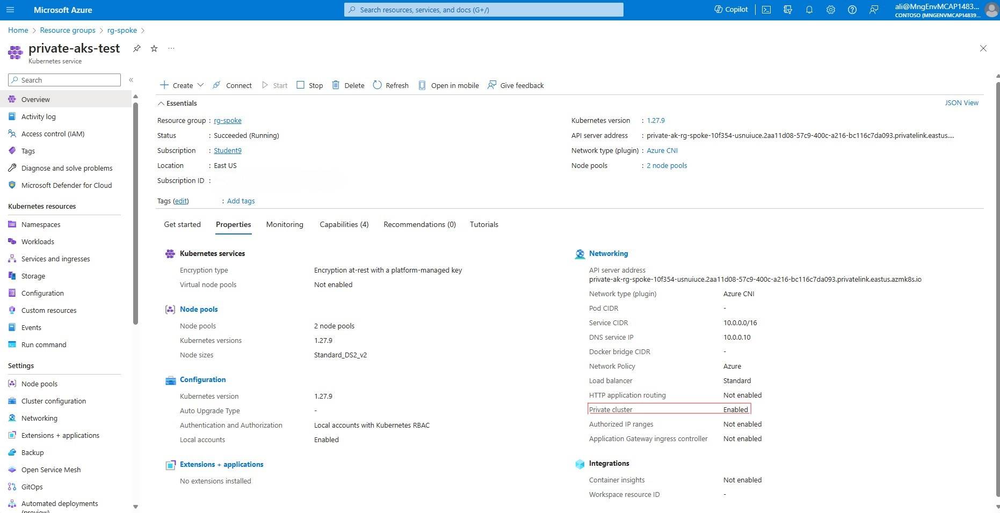
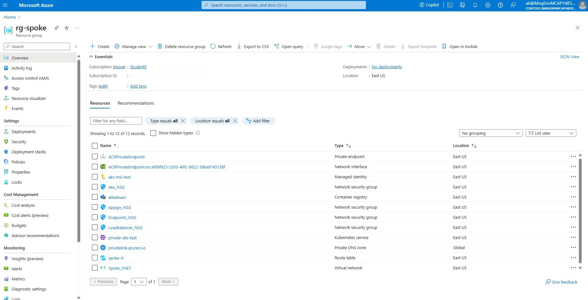
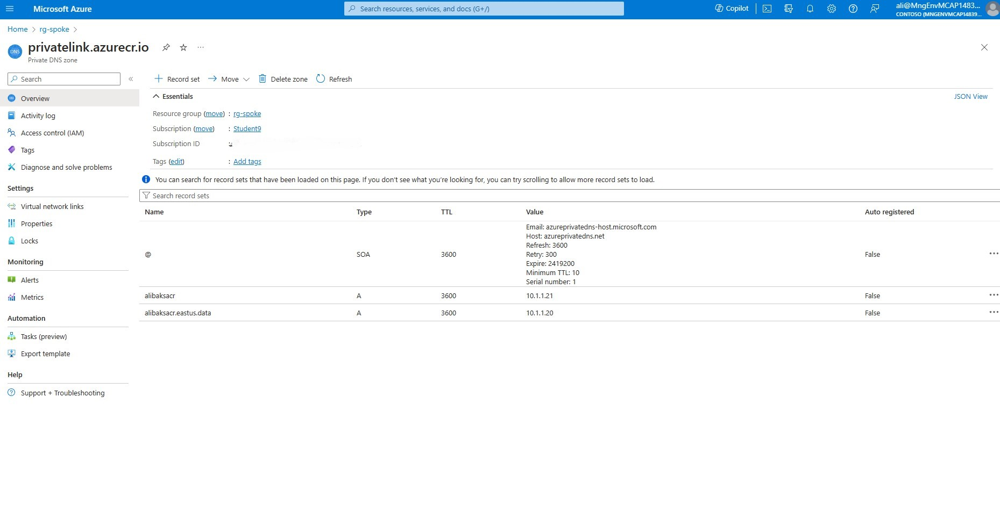
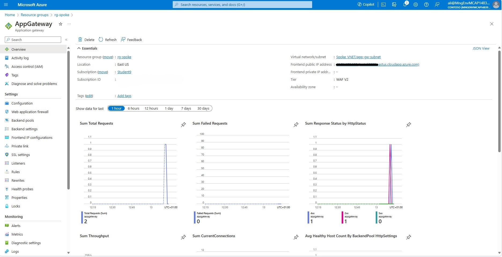

# Deploy Infrastructure

 **In This Article:**
- [Deploy Infrastructure](#deploy-infrastructure)
  - [1.1 Deployment](#11-deployment)
    - [1.1.1 Prepare Environment Variables for infrastructure](#111-prepare-environment-variables-for-infrastructure)
    - [1.1.2 Create the Resource Groups for the Hub and Spoke.](#112-create-the-resource-groups-for-the-hub-and-spoke)
    - [1.1.3 Create Network Security Groups (NSG) and Virtual Network (Vnet) for the Hub.](#113-create-network-security-groups-nsg-and-virtual-network-vnet-for-the-hub)
    - [1.1.4 Create Network Security Groups and Virtual Network for the Spoke.](#114-create-network-security-groups-and-virtual-network-for-the-spoke)
    - [1.1.5 Create Vnet Peering Between Hub and Spoke](#115-create-vnet-peering-between-hub-and-spoke)
    - [1.1.6 Create Azure Bastion and Jumpbox VM](#116-create-azure-bastion-and-jumpbox-vm)
    - [1.1.7 Create an Azure Firewall and Setup a UDR](#117-create-an-azure-firewall-and-setup-a-udr)
    - [1.1.8 Deploy Azure Kubernetes Service](#118-deploy-azure-kubernetes-service)
    - [1.1.9 Deploy Azure Container Registry](#119-deploy-azure-container-registry)
    - [1.1.10 Deploy Azure Application Gateway.](#1110-deploy-azure-application-gateway)
    - [1.1.11 Validate Ingress Connection.](#1111-validate-ingress-connection)
    - [1.1.12 Clean Up Resources in AKS](#1112-clean-up-resources-in-aks)


The objective of this chapter is to guide you through the process of deploying the AKS baseline infrastructure. This infrastructure consists of the essential components and configurations that are required for running a secure and scalable AKS cluster. By following the steps in this chapter, you will be able to set up the AKS baseline infrastructure.

## 1.1 Deployment

### 1.1.1 Prepare Environment Variables for infrastructure

This configuration sets up environment variables for the names and locations of various network and security resources, such as resource group, virtual network, subnets, network security groups, firewall, application gateway, route table, identity, virtual machine, AKS cluster, and ACR registry.

> [!Note]
> Since the Azure container registry has a globally unique FQDN name, you need to assign a distinct value to the **ACR_NAME** environment variable, else the ACR deployment will fail. 

````bash
HUB_RG=rg-hub
SPOKE_RG=rg-spoke
LOCATION=eastus 
BASTION_NSG_NAME=Bastion_NSG
JUMPBOX_NSG_NAME=Jumpbox_NSG
AKS_NSG_NAME=Aks_NSG
ENDPOINTS_NSG_NAME=Endpoints_NSG
LOADBALANCER_NSG_NAME=Loadbalancer_NSG
APPGW_NSG=Appgw_NSG
FW_NAME=azure-firewall
APPGW_NAME=AppGateway
ROUTE_TABLE_NAME=spoke-rt
AKS_IDENTITY_NAME=aks-msi
JUMPBOX_VM_NAME=Jumpbox-VM
AKS_CLUSTER_NAME=private-aks
ACR_NAME=<NAME OF THE AZURE CONTAINER REGISTRY>
STUDENT_NAME=<WRITE YOUR STUDENT NAME HERE>
````

### 1.1.2 Create the Resource Groups for the Hub and Spoke.

````bash
az group create --name $HUB_RG --location $LOCATION
az group create --name $SPOKE_RG --location $LOCATION
````

### 1.1.3 Create Network Security Groups (NSG) and Virtual Network (Vnet) for the Hub.
In this step, we will begin by establishing a Network Security Group (NSG) that will subsequently be associated with their respective subnet. It is crucial to note that there are specific prerequisites concerning security rules for certain subnets that must be met  before a service can be deployed, Azure Bastion is one of them.

For Azure Bastion, we are establishing security rules to permit both the control and data plane access to the AzureBastion. For a more detailed understanding of these rules, please refer to the following resource: [More Information](https://learn.microsoft.com/en-us/azure/bastion/bastion-nsg).

1) Lets Create the NSG for AzureBastionSubnet.
````bash
az network nsg create \
    --resource-group $HUB_RG \
    --name $BASTION_NSG_NAME \
    --location $LOCATION
````

2) Associate the required **inbound** security rules to the NSG.
````bash
    az network nsg rule create --name AllowHttpsInbound \
    --nsg-name $BASTION_NSG_NAME --priority 120 --resource-group $HUB_RG\
    --access Allow --protocol TCP --direction Inbound \
    --source-address-prefixes "Internet" \
    --source-port-ranges "*" \
    --destination-address-prefixes "*" \
    --destination-port-ranges "443"
	
   	az network nsg rule create --name AllowGatewayManagerInbound \
    --nsg-name $BASTION_NSG_NAME --priority 130 --resource-group $HUB_RG\
    --access Allow --protocol TCP --direction Inbound \
    --source-address-prefixes "GatewayManager" \
    --source-port-ranges "*" \
    --destination-address-prefixes "*" \
    --destination-port-ranges "443"
	
	az network nsg rule create --name AllowAzureLoadBalancerInbound \
    --nsg-name $BASTION_NSG_NAME --priority 140 --resource-group $HUB_RG\
    --access Allow --protocol TCP --direction Inbound \
    --source-address-prefixes "AzureLoadBalancer" \
    --source-port-ranges "*" \
    --destination-address-prefixes "*" \
    --destination-port-ranges "443"
	
	
	az network nsg rule create --name AllowBastionHostCommunication \
    --nsg-name $BASTION_NSG_NAME --priority 150 --resource-group $HUB_RG\
    --access Allow --protocol TCP --direction Inbound \
    --source-address-prefixes "VirtualNetwork" \
    --source-port-ranges "*" \
    --destination-address-prefixes "VirtualNetwork" \
    --destination-port-ranges 8080 5701
````

3) Associate the required **outbound** security rules to the NSG.

````bash
    az network nsg rule create --name AllowSshRdpOutbound \
    --nsg-name $BASTION_NSG_NAME --priority 100 --resource-group $HUB_RG\
    --access Allow --protocol "*" --direction outbound \
    --source-address-prefixes "*" \
    --source-port-ranges "*" \
    --destination-address-prefixes "VirtualNetwork" \
    --destination-port-ranges 22 3389
	
    az network nsg rule create --name AllowAzureCloudOutbound \
    --nsg-name $BASTION_NSG_NAME --priority 110 --resource-group $HUB_RG\
    --access Allow --protocol Tcp --direction outbound \
    --source-address-prefixes "*" \
    --source-port-ranges "*" \
    --destination-address-prefixes "AzureCloud" \
    --destination-port-ranges 443
	
	az network nsg rule create --name AllowBastionCommunication \
    --nsg-name $BASTION_NSG_NAME --priority 120 --resource-group $HUB_RG\
    --access Allow --protocol "*" --direction outbound \
    --source-address-prefixes "VirtualNetwork" \
    --source-port-ranges "*" \
    --destination-address-prefixes "VirtualNetwork" \
    --destination-port-ranges 8080 5701
	
	az network nsg rule create --name AllowHttpOutbound \
    --nsg-name $BASTION_NSG_NAME --priority 130 --resource-group $HUB_RG\
    --access Allow --protocol "*" --direction outbound \
    --source-address-prefixes "*" \
    --source-port-ranges "*" \
    --destination-address-prefixes "Internet" \
    --destination-port-ranges 80
````

4) Create an NSG for the JumpBox subnet.

````bash
az network nsg create \
    --resource-group $HUB_RG \
    --name $JUMPBOX_NSG_NAME \
    --location $LOCATION
````
5) Create the HUB VNET with one subnet for **Azure Bastion Subnet** and associate it to the bastion NSG.

````bash
az network vnet create \
    --resource-group $HUB_RG  \
    --name $HUB_VNET_NAME \
    --address-prefixes $HUB_VNET_PREFIX \
    --subnet-name $BASTION_SUBNET_NAME \
    --subnet-prefixes $BASTION_SUBNET_PREFIX \
    --network-security-group $BASTION_NSG_NAME
````
6) Create a subnet for the Azure Firewall.


````bash
az network vnet subnet create \
    --resource-group $HUB_RG  \
    --vnet-name $HUB_VNET_NAME \
    --name $FW_SUBNET_NAME \
    --address-prefixes $FW_SUBNET_PREFIX
````

7) Create a subnet for the Virtual Machine that will be used as "jumpbox".

````bash
az network vnet subnet create \
    --resource-group $HUB_RG  \
    --vnet-name $HUB_VNET_NAME \
    --name $JUMPBOX_SUBNET_NAME \
    --address-prefixes $JUMPBOX_SUBNET_PREFIX \
    --network-security-group $JUMPBOX_NSG_NAME
````
You have successfully configured the network for your hub virtual network.You have established three subnets and two NSGs, as depicted on the image:


Validate your deployment in the Azure portal.

8) Navigate to the Azure portal at [https://portal.azure.com](https://portal.azure.com) and enter your login credentials.

9) Once logged in, locate and select your resource group called **rg-hub** where the hub vnet is deployed.

10) Select your vnet called **HUB_VNET**.

11) In the left-hand side menu, under the **Settings** section, select **Subnets**.
12) Make sure that your subnets have the appropriate IP range and that Network Security Groups (NSGs) are correctly associated with their respective subnets as depicted below.


### 1.1.4 Create Network Security Groups and Virtual Network for the Spoke.
We will now start to setup the spoke vnet, subnets and their respective NSGs,

1) Create the NSG for AKS subnet.
````bash
az network nsg create \
    --resource-group $SPOKE_RG \
    --name $AKS_NSG_NAME \
    --location $LOCATION
````
2) Create the NSG for endpoints subnet, were the endpoints will reside.
````bash
az network nsg create \
    --resource-group $SPOKE_RG \
    --name $ENDPOINTS_NSG_NAME \
    --location $LOCATION
````
3) Create the NSG for load balancer subnet, were the internal load balancer will reside.
````bash
az network nsg create \
    --resource-group $SPOKE_RG \
    --name $LOADBALANCER_NSG_NAME \
    --location $LOCATION
````
4) To use an NSG with your application gateway, you need to open these port ranges:

Inbound rules: The **Internet service tag** needs access to port **65200-65535** for the backend health API. Your application traffic needs access to TCP port **80 and/or 443**. for futher information refer to [Required security rules for Application Gateway](https://learn.microsoft.com/en-us/azure/application-gateway/configuration-infrastructure#required-security-rules) for more information.
````bash
az network nsg create \
    --resource-group $SPOKE_RG \
    --name $APPGW_NSG \
    --location $LOCATION
````
5) Create the NSG rule to allow application traffic, on port 443 and 80.

````bash
# Allow Internet Client request on Port 443 and 80
az network nsg rule create \
    --resource-group $SPOKE_RG \
    --nsg-name $APPGW_NSG \
    --name Allow-Internet-Inbound-HTTP-HTTPS \
    --priority 100 \
    --source-address-prefixes Internet \
    --destination-port-ranges 80 443 \
    --access Allow \
    --protocol Tcp \
    --description "Allow inbound traffic to port 80 and 443 to Application Gateway from client requests originating from the Internet"
````
6) Create the NSG rule to allow application traffic, on port range 65200-65535.
````bash
# Infrastructure ports
az network nsg rule create \
    --resource-group $SPOKE_RG \
    --nsg-name $APPGW_NSG \
    --name Allow-GatewayManager-Inbound \
    --priority 110 \
    --source-address-prefixes "GatewayManager" \
    --destination-port-ranges 65200-65535 \
    --access Allow \
    --protocol Tcp \
    --description "Allow inbound traffic to ports 65200-65535 from GatewayManager service tag"
````
7) Create the spoke VNET with one subnet for **AKS Subnet** and associate it to the AKS NSG.

````bash
az network vnet create \
    --resource-group $SPOKE_RG  \
    --name $SPOKE_VNET_NAME \
    --address-prefixes $SPOKE_VNET_PREFIX \
    --subnet-name $AKS_SUBNET_NAME \
    --subnet-prefixes $AKS_SUBNET_PREFIX \
	--network-security-group $AKS_NSG_NAME
````

8) Create the subnet for **Endpoints** and associate it to the endpoints NSG.

````bash
az network vnet subnet create \
    --resource-group $SPOKE_RG  \
    --vnet-name $SPOKE_VNET_NAME  \
    --name $ENDPOINTS_SUBNET_NAME \
    --address-prefixes $ENDPOINTS_SUBNET_PREFIX \
	--network-security-group $ENDPOINTS_NSG_NAME
````
9) Create subnet for the **load balancer** that will be used for ingress traffic and associate it to the loadbalancer NSG.

````bash
az network vnet subnet create \
    --resource-group $SPOKE_RG  \
    --vnet-name $SPOKE_VNET_NAME \
    --name $LOADBALANCER_SUBNET_NAME \
    --address-prefixes $LOADBALANCER_SUBNET_PREFIX \
	--network-security-group $LOADBALANCER_NSG_NAME
````

10) Create subnet for the **Application Gateway** and associate it to the Application Gateway NSG.

````bash
az network vnet subnet create \
    --resource-group $SPOKE_RG  \
    --vnet-name $SPOKE_VNET_NAME \
    --name $APPGW_SUBNET_NAME \
    --address-prefixes $APPGW_SUBNET_PREFIX \
	--network-security-group $APPGW_NSG
````
You have successfully configured the network for your spoke virtual network. You should now have established the following setup in your Azure subscription.


Validate your deployment in the Azure portal.

11) Navigate to the Azure portal at [https://portal.azure.com](https://portal.azure.com) and enter your login credentials.

12) Once logged in, locate and select your resource group called **rg-spoke** where the spoke vnet is deployed.

13) Select your vnet called **Spoke_VNET**.

14) In the left-hand side menu, under the **Settings** section, select **Subnets**.
15) Make sure that your subnets have the appropriate IP range and that Network Security Groups (NSGs) are correctly associated with their respective subnets as depicted below.


### 1.1.5 Create Vnet Peering Between Hub and Spoke

The next step is to create a virtual network peering between the hub and spoke VNets. This will enable the communication between the VNets and allow the AKS cluster to route traffic to the Firewall.

1) Before we can do a Vnet peering we need to obtain the full resource id of the Spoke_VNET and Hub_VNET as they resides in different resource group.

````bash
SPOKE_VNET_ID=$(az network vnet show --resource-group $SPOKE_RG --name $SPOKE_VNET_NAME --query id --output tsv)
````

````bash
HUB_VNET_ID=$(az network vnet show --resource-group $HUB_RG --name $HUB_VNET_NAME --query id --output tsv)
````

1) Create a peering connection from the hub to spoke virtual networks.

````bash
az network vnet peering create \
    --resource-group $HUB_RG  \
    --name hub-to-spoke \
    --vnet-name $HUB_VNET_NAME \
    --remote-vnet $SPOKE_VNET_ID \
    --allow-vnet-access
````

2) Create a peering connection from  the spoke to hub virtual networks.

````bash
az network vnet peering create \
    --resource-group $SPOKE_RG  \
    --name spoke-to-hub \
    --vnet-name $SPOKE_VNET_NAME \
    --remote-vnet $HUB_VNET_ID \
    --allow-vnet-access
````
Peering should be established and the high level design should now look like this.


Validate your deployment in the Azure portal.

3) Navigate to the Azure portal at [https://portal.azure.com](https://portal.azure.com) and enter your login credentials.

4) Once logged in, locate and select your resource group called **rg-spoke** where the spoke vnet is deployed.

5) Select your vnet called **Spoke_VNET**.

6) In the left-hand side menu, under the **Settings** section, select **peerings**.
7) Ensure that the peering status is set to **Connected**

8) Repeat step 4 - 7 but for Hub_VNET.


### 1.1.6 Create Azure Bastion and Jumpbox VM

1) Create a public IP address for the bastion host

````bash
az network public-ip create \
    --resource-group $HUB_RG  \
    --name Bastion-PIP \
    --sku Standard \
    --allocation-method Static
````
2) Create JumpBox Virtual Machine.

> [!Note]
> Ensure you specify a **password** for the admin user called **azureuser**.
> The password length must be between 12 and 72. Password must have the 3 of the following: 1 lower case character, 1 upper case character, 1 number and 1 special character.


````bash
az vm create \
    --resource-group $HUB_RG \
    --name $JUMPBOX_VM_NAME \
    --image Ubuntu2204 \
    --admin-username azureuser \
    --admin-password <SPECIFY A PASSWORD HERE> \
    --vnet-name $HUB_VNET_NAME \
    --subnet $JUMPBOX_SUBNET_NAME \
    --size Standard_B2s \
    --storage-sku Standard_LRS \
    --os-disk-name $JUMPBOX_VM_NAME-VM-osdisk \
    --os-disk-size-gb 128 \
    --public-ip-address "" \
    --nsg ""  
  ````


4) Create the bastion host in hub vnet and associate it to the public IP.
> [!Note]
> Azure Bastion service requires a dedicated subnet named **AzureBastionSubnet** to provide secure and seamless RDP/SSH connectivity to your virtual machines. When you deploy Azure Bastion service, it will automatically create this subnet for you, if it does not exist in the target virtual network. However, if the subnet already exists, it must meet the minimum size of **/26** or larger, otherwise the deployment will fail.

````bash
az network bastion create \
    --resource-group $HUB_RG \
    --name bastionhost \
    --public-ip-address Bastion-PIP \
    --vnet-name $HUB_VNET_NAME \
    --location $LOCATION
````
5) Connect to VM using the portal:

Upon successful installation of the Jumpbox Virtual Machine (VM), the next step is to validate the connectivity between the Bastion and Jumpbox host. Here are the steps to follow:

6) Navigate to the Azure portal at [https://portal.azure.com](https://portal.azure.com) and enter your login credentials.

7) Once logged in, locate and select your **rg-hub** where the Jumpbox has been deployed.

8) Within your resource group, find and click on the **Jumpbox VM**.

9) In the left-hand side menu, under the **Connect** section, select ‘Bastion’.

10) Enter the **credentials** for the Jumpbox VM and verify that you can log in successfully. 

For additional information on accessing VMs through Bastion, please refer to this [Microsoft Azure Bastion tutorial](https://learn.microsoft.com/en-us/azure/bastion/create-host-cli#steps)

After completing these steps, The high-level targeted architecture now matches the following diagram:


### 1.1.7 Create an Azure Firewall and Setup a UDR

To secure your AKS outbound traffic, you need to follow these steps for a basic cluster deployment. These steps will help you restrict the outbound access and to certain FQDNs that are needed by the cluster. further information can be found here: [Control egress traffic using Azure Firewall in Azure Kubernetes Service (AKS)](https://learn.microsoft.com/en-us/azure/aks/limit-egress-traffic)

1) Create Azure Firewall, and deploy it to it to firewall subnet in hub vnet.
````bash
az network firewall create \
    --resource-group $HUB_RG \
    --name $FW_NAME \
    --location $LOCATION \
    --vnet-name $HUB_VNET_NAME \
    --enable-dns-proxy true

````
2) Create the Public IP address resource.

````bash
az network public-ip create \
    --name fw-pip \
    --resource-group $HUB_RG \
    --location $LOCATION \
    --allocation-method static \
    --sku standard

````

3) Associate the public IP address with the Firewall.

````bash
az network firewall ip-config create \
    --firewall-name $FW_NAME \
    --name FW-config \
    --public-ip-address fw-pip \
    --resource-group $HUB_RG \
    --vnet-name $HUB_VNET_NAME

````
4) Update the existing Azure Firewall configuration.

````bash
az network firewall update \
    --name $FW_NAME \
    --resource-group $HUB_RG 
````
5) Create Network rules in Azure Firewall
 
The following network rules allows outbound traffic from any source address to certain destinations and ports. If the required destination is not specified the AKS cluster will fail to deploy.

````bash
az network firewall network-rule create -g $HUB_RG -f $FW_NAME --collection-name 'aksfwnr' -n 'apiudp' --protocols 'UDP' --source-addresses '*' --destination-addresses "AzureCloud.$LOCATION" --destination-ports 1194 --action allow --priority 100
````
````bash
az network firewall network-rule create -g $HUB_RG -f $FW_NAME --collection-name 'aksfwnr' -n 'apitcp' --protocols 'TCP' --source-addresses '*' --destination-addresses "AzureCloud.$LOCATION" --destination-ports 9000
````
````bash
az network firewall network-rule create -g $HUB_RG -f $FW_NAME --collection-name 'aksfwnr' -n 'time' --protocols 'UDP' --source-addresses '*' --destination-fqdns 'ntp.ubuntu.com' --destination-ports 123
````
6) Create Azure Firewall application rule

This rules specifies the FQDN's which are required by AKS, **AzureKubernetesService** tag which include all the FQDNs listed in Outbound network and FQDN rules for AKS clusters.

````bash
az network firewall application-rule create -g $HUB_RG -f $FW_NAME --collection-name 'aksfwar' -n 'fqdn' --source-addresses '*' --protocols 'http=80' 'https=443' --fqdn-tags "AzureKubernetesService" --action allow --priority 100
````

7) Create a route table in the spoke.
````bash
az network route-table create \
    --resource-group $SPOKE_RG  \
    --name $ROUTE_TABLE_NAME

````

8) Create a route to the internet via the Azure Firewall

In order to create the route we need to obtain the private IP address of the Firewall.To get the private IP address of the Firewall, you need to run the following command:

````bash
az network firewall show --resource-group $HUB_RG --name $FW_NAME |grep  privateIPAddress
````

Then store the output (the ip address) in an environment variable:
````bash
FW_PRIVATE_IP=<IP Address from previous command>
````

Create the route table to route egress traffic to the firewall in the hub VNET:
````bash
az network route-table route create \
    --resource-group $SPOKE_RG  \
    --name default-route \
    --route-table-name $ROUTE_TABLE_NAME \
    --address-prefix 0.0.0.0/0 \
    --next-hop-type VirtualAppliance \
    --next-hop-ip-address $FW_PRIVATE_IP

````
> [!Note]
> The route will direct all traffic (0.0.0.0/0) to the next hop type of VirtualAppliance, which is the firewall instance. The next hop IP address is the private IP address of the firewall, which is stored in the environment variable $FW_PRIVATE_IP. This way, the traffic from the AKS subnet will be routed to the firewall instance on its private endpoint. This will allow you to perform inspection on outbound traffic.

9) Associate the route table with the AKS subnet.

````bash
az network vnet subnet update \
    --resource-group $SPOKE_RG  \
    --vnet-name $SPOKE_VNET_NAME \
    --name $AKS_SUBNET_NAME \
    --route-table $ROUTE_TABLE_NAME
````
You have successfully configured the firewall in the hub VNet, set up network and application rules, and created a route table associated with the AKS subnet to direct all internet-bound traffic through the Azure Firewall.


Validate your deployment in the Azure portal.

10) Navigate to the Azure portal at [https://portal.azure.com](https://portal.azure.com) and enter your login credentials.

11) Once logged in, locate and select your resource group called **rg-hub** where the hub vnet is deployed.

12) Select your firewall called **azure-firewall**.

13) In the left-hand side menu, under the **Settings** section, select **Rules**.

14) Click on  **Network rule collection**

15) Verify that you have a network rule collection called **aksfwnr** which should contain 3 rules. Inspect the rules.


16) Click on **Application rule collection**.

17) Verify that you have an application rule collection called **aksfwar** which should contain 1 rule. Inspect the rule.


18) Lets validate the routing between AKS subnet and Azure Firewall, in the Azure portal, in the top menu select **Resource Groups**. 
19) Select resource group **rg-spoke**.

20) Select routing table called **spoke-rt**.

21) Ensure that the default route has a prefix of **0.0.0.0/0** and the next hop is set to the **virtual appliance** with the **IP** address of the Azure Firewall. Also, make sure that the routing table is associated with the AKS subnet called **aks-subnet**.


### 1.1.8 Deploy Azure Kubernetes Service

This chapter covers deploying AKS with outbound traffic configured to use a user-defined routing table, ensuring traffic passes through the Azure Firewall. A private DNS zone is also created when deploying a private AKS cluster. A user-assigned identity with necessary permissions is assigned to the cluster and load balancer subnet. This identity is a type of managed identity in Azure.

1) Create a user-assigned managed identity.

````bash
az identity create \
    --resource-group $SPOKE_RG \
    --name $AKS_IDENTITY_NAME-${STUDENT_NAME}
````
2) Get the id of the user managed identity.

````bash
 IDENTITY_ID=$(az identity show \
    --resource-group $SPOKE_RG \
    --name $AKS_IDENTITY_NAME-${STUDENT_NAME} \
    --query id \
    --output tsv)
````
3) Get the principal id of the user managed identity.

````bash
PRINCIPAL_ID=$(az identity show \
    --resource-group $SPOKE_RG \
    --name $AKS_IDENTITY_NAME-${STUDENT_NAME} \
    --query principalId \
    --output tsv)
````

4) Get the scope of the routing table.

````bash
RT_SCOPE=$(az network route-table show \
    --resource-group $SPOKE_RG \
    --name $ROUTE_TABLE_NAME  \
    --query id \
    --output tsv)
````
5) Assign permissions for the AKS user defined managed identity to the routing table.

````bash
az role assignment create \
    --assignee $PRINCIPAL_ID\
    --scope $RT_SCOPE \
    --role "Network Contributor"
````

6) Assign permission for the AKS user defined managed identity to the load balancer subnet

````bash
LB_SUBNET_SCOPE=$(az network vnet subnet list \
    --resource-group $SPOKE_RG \
    --vnet-name $SPOKE_VNET_NAME \
    --query "[?name=='$LOADBALANCER_SUBNET_NAME'].id" \
    --output tsv)
````

````bash
az role assignment create \
    --assignee $PRINCIPAL_ID \
    --scope $LB_SUBNET_SCOPE \
    --role "Network Contributor"

````
> [!Note]
> Granting the Network Contributor role to the load balancer subnet in AKS could result in over-privileged access. To minimize security risks, it is recommended to only provide AKS with the necessary permissions to function effectively, adhering to the principle of least privilege access. For more information refer to [Creating Azure custom role](./docs/customrole.md)

7) Retrieve the scope of AKS subnet, were AKS shall be deployed.

````bash
AKS_SUBNET_SCOPE=$(az network vnet subnet list \
    --resource-group $SPOKE_RG \
    --vnet-name $SPOKE_VNET_NAME \
    --query "[?name=='$AKS_SUBNET_NAME'].id" \
    --output tsv)
````
8) Deploy a Highly Available Private AKS Cluster

To deploy a highly available private AKS cluster, you can use the following command:

This command creates an AKS cluster with two system nodes, using the specified VNet subnet ID and cluster name. It is configured as a private cluster with user-defined routing and OIDC issuer and workload identity enabled. The network plugin and policy are set to Azure, and the public FQDN is disabled. The cluster is deployed across availability zones 1, 2, and 3

````bash
az aks create --resource-group $SPOKE_RG --node-count 2 --vnet-subnet-id $AKS_SUBNET_SCOPE --name $AKS_CLUSTER_NAME-${STUDENT_NAME} --enable-private-cluster --outbound-type userDefinedRouting --enable-oidc-issuer --enable-workload-identity --generate-ssh-keys --assign-identity $IDENTITY_ID --network-plugin azure --network-policy azure --disable-public-fqdn --zones 1 2 3
````

> [!Note]
> A private AKS cluster has its Kubernetes API endpoint isolated from public access, allowing access only within the same virtual network. To communicate with the private AKS cluster from a jumpbox in a different virtual network, a virtual network link must be created between the two networks for DNS resolution. This will be covered in the next section.

9) An additional nodepool will be created to host user workloads. Auto-scaling is enabled to allow for automatic scaling out and scaling in based on demand. The worker nodes will be distributed across three different zones to ensure higher availability

````bash
az aks nodepool add --resource-group $SPOKE_RG --cluster-name $AKS_CLUSTER_NAME-${STUDENT_NAME} --name userpool --node-count 3 --mode user --zones 1 2 3 --enable-cluster-autoscaler --min-count 1 --max-count 5
````

10) Create a virtual network link to resolve AKS private endpoint from HUB vnet.

Fetch the node group of the AKS cluster, and save it in an environment variable.
````bash
NODE_GROUP=$(az aks show --resource-group $SPOKE_RG --name $AKS_CLUSTER_NAME-${STUDENT_NAME} --query nodeResourceGroup -o tsv)
````
Fetch the AKS DNS zone name.

````bash
DNS_ZONE_NAME=$(az network private-dns zone list --resource-group $NODE_GROUP --query "[0].name" -o tsv)

````
Fetch the ID of the HUB virtual network.

````bash
HUB_VNET_ID=$(az network vnet show -g $HUB_RG -n $HUB_VNET_NAME --query id --output tsv)
````
Create a virtual network link between the hub virtual network and the AKS private DNS zone, that was created for the AKS cluster.

````bash
az network private-dns link vnet create --name "hubnetdnsconfig" --registration-enabled false --resource-group $NODE_GROUP --virtual-network $HUB_VNET_ID --zone-name $DNS_ZONE_NAME 
````

Validate your deployment in the Azure portal.

11) Navigate to the Azure portal at [https://portal.azure.com](https://portal.azure.com) and enter your login credentials.

12) Once logged in, click on **Resource groups** to view all of your resource groups in your subscription. You should have 3 RGs which you have created,**MC_rg-spoke_private-aks-xxxx_eastus**, **rg-hub** and **rg-spoke** 

> [!Note]
> MC_rg-spoke_private-aks-xxxx_eastus is a resource group automatically created when deploying an AKS cluster. It is used by Azure to manage resources for the cluster, this particular resource group is also known as Node group.


13) Verify that a virtual network link exists between the Hub and spoke to enable the jumpbox to resolve the AKS domain name and access the cluster. Select the node group called **MC_rg-spoke_private-aks-xxxxx_eastus**

14) Select the **Private DNS zone**.
15) On your left hand side menu, under **Settings** click on **Virtual network links**.

16) Validate that there is a link name called **hubnetdnsconfig** and the link status is set to **Completed** and the virtual network is set to **Hub_VNET**.


17) On the top menu click **Resource groups** and choose **rg-spoke** from the resource group list.

18) Click on the AKS resource called private-aks-<YOUR STUDENT NAME>. Verify that the Private cluster is set to Enabled. 



19) Verify AKS control plane connectivity.

In this section we will verify that we are able to connect to the AKS cluster from the jumpbox, firstly we need to connect to the cluster successfully and secondly we need to verify that the kubernetes client is able to communicate with the AKS control plane from the jumpbox. 

20) Select resource group **rg-hub** where the Jumpbox has been deployed.

21) Within your resource group, find and click on the virtual machine called **Jumpbox VM**.

22) In the left-hand side menu, under  **Connect** section, select **Bastion**.

23) Enter the **credentials** for the Jumpbox VM and verify that you can log in successfully.

24) Once successfully logged in to the jumbox you need to install a few tools

````bash
#!/bin/bash
# Update apt repo
sudo apt update 
# Install Docker
sudo apt install docker.io -y
# Install azure CLI
curl -sL https://aka.ms/InstallAzureCLIDeb | sudo bash
# Install AKS CLI (kubectl)
sudo az aks install-cli
# Add user to Docker group
sudo usermod -aG docker $USER
````

  
7) Now, **login to Azure** in order to obtain AKS credentials.

````bash
az login
az account set --subscription <SUBSCRIPTION ID>
````
> [!Note]
> To check the current subscription, run the command: **az account show**
To change the subscription, run the command: **az account set --subscription <SUBSCRIPTION ID>, where <SUBSCRIPTION ID>** the ID of the desired subscription. You can find the subscription ID by running the command: **az account list --output table**

8) Add your Environment variables to the jumpbox bash shell.

````bash
SPOKE_RG=rg-spoke
AKS_CLUSTER_NAME=private-aks
STUDENT_NAME=<WRITE YOUR STUDENT NAME HERE>
````

8) Download the AKS credentials onto the jumpbox.

````bash
az aks get-credentials --resource-group $SPOKE_RG --name $AKS_CLUSTER_NAME-${STUDENT_NAME}
````
9) Ensure you can list resources in AKS.

````bash
kubectl get nodes
````

The following output shows the result of running the command kubectl get nodes on with kubectl CLI.

````bash
azureuser@Jumpbox-VM:~$ kubectl get nodes
NAME                                STATUS   ROLES   AGE   VERSION
aks-nodepool1-12240482-vmss000000   Ready    agent   89m   v1.27.9
aks-nodepool1-12240482-vmss000001   Ready    agent   89m   v1.27.9
aks-userpool-16991029-vmss000000    Ready    agent   78m   v1.27.9
````
10) log out from the Jumpbox host.

Congratulations! You have completed the steps to deploy a private AKS cluster and configure its network settings. You have assigned a user assigned identity to the cluster that has the required permissions to modify the user-defined routing table and load balancer subnet. You have also created a virtual network link between the hub virtual network and the private DNS zone of the cluster. This enables the jumpbox to resolve the private API server of the cluster and access it for management and maintenance purposes.


### 1.1.9 Deploy Azure Container Registry
In this chapter, we will learn how to deploy a private Azure container registry that will store our container images. A private container registry is a type of container registry that is not accessible from the public internet. To enable access to the private container registry from the jumpbox, we need to create some network resources that will allow us to resolve the container registry name and connect to it securely. These resources are: a private endpoint, a private link, and a virtual network link. We will see how to create and configure these resources in the following steps. We will also test the connection to the private container registry by pushing some images to it from the jumpbox.

1) Create the Azure Container Registry, and disable public access to the registry.

````bash
az acr create \
    --resource-group $SPOKE_RG \
    --name $ACR_NAME \
    --sku Premium \
    --admin-enabled false \
    --location $LOCATION \
    --allow-trusted-services false \
    --public-network-enabled false
````
> [!IMPORTANT]
> Ensure you have a global unique name for your ACR, else the deployment will fail.


2) Disable endpoint network policies.

````bash
az network vnet subnet update \
 --name $ENDPOINTS_SUBNET_NAME \
 --vnet-name $SPOKE_VNET_NAME\
 --resource-group $SPOKE_RG \
 --disable-private-endpoint-network-policies
````

3) Configure the private DNS zone for ACR.

````bash
az network private-dns zone create \
  --resource-group $SPOKE_RG \
  --name "privatelink.azurecr.io"
````

 
4) Create a virtual network link to the spoke network.
````bash
az network private-dns link vnet create \
  --resource-group $SPOKE_RG \
  --zone-name "privatelink.azurecr.io" \
  --name ACRDNSSpokeLink \
  --virtual-network $SPOKE_VNET_NAME \
  --registration-enabled false
````
5) Creates a virtual network link to the hub network.

> [!Note]
> The $HUB_VNET_ID variable specifies the full path to the virtual network in another resource group, allowing the command to correctly link to it.

````bash
az network private-dns link vnet create \
  --resource-group $SPOKE_RG \
  --zone-name "privatelink.azurecr.io" \
  --name ACRDNSHubLink \
  --virtual-network $HUB_VNET_ID \
  --registration-enabled false
````

6) Create ACR private endpoint 

To create a private endpoint for an Azure Container Registry (ACR), you need to obtain the resource ID of the container registry. This resource ID is used to specify the target resource when creating the private endpoint.

````bash
REGISTRY_ID=$(az acr show --name $ACR_NAME \
  --query 'id' --output tsv)

````

````bash
az network private-endpoint create \
    --name ACRPrivateEndpoint \
    --resource-group $SPOKE_RG \
    --vnet-name $SPOKE_VNET_NAME \
    --subnet $ENDPOINTS_SUBNET_NAME \
    --private-connection-resource-id $REGISTRY_ID \
    --group-ids registry \
    --connection-name PrivateACRConnection
````
7) Configure DNS record for ACR

In this section we will configure DNS records for an Azure Container Registry (ACR) using Azure Private Link.This is to ensure that the ACR can be accessed over a private network connection, enhancing security by eliminating exposure to the public internet.

Before we can configure the DNS record we need to obtain the private IP address  of the ACR, both the control and dataplane.

Get endpoint IP configuration:

````bash
NETWORK_INTERFACE_ID=$(az network private-endpoint show \
  --name ACRPrivateEndpoint \
  --resource-group $SPOKE_RG \
  --query 'networkInterfaces[0].id' \
  --output tsv)
 ```` 

Fetch the private IP address associated with the ACR, these IP addresses are used for data and control of the container registry.

````bash
az network nic show --ids $NETWORK_INTERFACE_ID |grep azurecr.io -B 7
````
In the output you should see two IP addresses, and their associated FQDNS. It should look similar to this:

````
      "name": "privateEndpointIpConfig.9c4c0ee4-c187-4094-aede-fc0dabb70236",
      "primary": true,
      "privateIPAddress": "10.1.1.20",
      "privateIPAddressVersion": "IPv4",
      "privateIPAllocationMethod": "Dynamic",
      "privateLinkConnectionProperties": {
        "fqdns": [
          "acrforakssecurity.westus2.data.azurecr.io"
--
      "name": "privateEndpointIpConfig.7ffb814c-aacc-4199-a07d-35f61df0ea1f",
      "primary": false,
      "privateIPAddress": "10.1.1.21",
      "privateIPAddressVersion": "IPv4",
      "privateIPAllocationMethod": "Dynamic",
      "privateLinkConnectionProperties": {
        "fqdns": [
          "acrforakssecurity.azurecr.io"
````
Note down the **privateIPAddress** and **fqdns** as it will be used in a later step (when creating DNS zones).


8) Create a new 'A' record set for control in the private DNZ zone.

````bash
az network private-dns record-set a create \
  --name $ACR_NAME \
  --zone-name privatelink.azurecr.io \
  --resource-group $SPOKE_RG
````

9) Create a new 'A' record set for data in the private DNZ zone.

````bash
az network private-dns record-set a create \
  --name $ACR_NAME.$LOCATION.data \
  --zone-name privatelink.azurecr.io \
  --resource-group $SPOKE_RG
````
10) Update the 'A' record to contain the control IP address of the ACR.

````bash
az network private-dns record-set a add-record \
  --record-set-name $ACR_NAME \
  --zone-name privatelink.azurecr.io \
  --resource-group $SPOKE_RG \
  --ipv4-address <IP address associated with FQDN "$ACR_NAME.azurecr.io">

````

11) Update the 'A' record to contain the data IP address of the ACR.

````bash
az network private-dns record-set a add-record \
  --record-set-name $ACR_NAME.$LOCATION.data \
  --zone-name privatelink.azurecr.io \
  --resource-group $SPOKE_RG \
  --ipv4-address <IP address assicoated with FQDN "$ACR_NAME.$LOCATION.data.azurecr.io">
````

Validate your deployment in the Azure portal.

12) Navigate to the Azure portal at [https://portal.azure.com](https://portal.azure.com) and enter your login credentials.

13) log in and select the **rg-spoke** resource group. Verify that you have a **container registry** and a private endpoint named **ACRPrivateEndpoint** deployed in your resource group, as well as a network card named **ACRPrivateEndpoint.nic.xxxxx**



14) Select the private DNS zone named **privatelink.azurecr.io**. Ensure that you have two ‘A’ records, one for control and one for data, and that the correct IP addresses are configured.



15) In the left-hand side menu, under **Settings** section, select **Virtual Network links**. Ensure you have the link status set to completed for both hub and spoke.


16) Test the connection to ACR from the Jumpbox

In this section, you will learn how to check if you can access your private Azure Container Registry (ACR) and push Docker images to it. You will need to have the Azure CLI installed and logged in to your Azure account. You will also need to have Docker installed and running on your Jumpbox. Here are the steps to follow:

17) Select resource group **rg-hub** where the Jumpbox has been deployed.

18) Within your resource group, find and click on the **Jumpbox VM**.

19) In the left-hand side menu, under the **Connect** section, select ‘Bastion’.

20) Enter the **credentials** for the Jumpbox VM and verify that you can log in successfully.

21) Once successfully logged in to the jumpbox **login to Azure** if you have not already done so in previous steps.

````bash
az login
````
Identify your subscription id from the list, if you have several subscriptions.

````bash
az account list -o table
````
Set your subscription id to be the default subscription.
````bash
az account set --subscription <SUBSCRIPTION ID>
````
22) Validate private link connection 

List your ACR in your subscription and note down the ACR name.
````bash
az acr list -o table
````
example output:

````bash
azureuser@Jumpbox-VM:~$ az acr list -o table
NAME        RESOURCE GROUP    LOCATION    SKU      LOGIN SERVER           CREATION DATE         ADMIN ENABLED
----------  ----------------  ----------  -------  ---------------------  --------------------  ---------------
alibaksacr  rg-spoke          eastus      Premium  alibaksacr.azurecr.io  2024-03-03T07:56:00Z  False
````

````bash
dig <REGISTRY NAME>.azurecr.io
````
Example output shows the registry's private IP address in the address space of the subnet:
````dns

azureuser@Jumpbox-VM:~$ dig alibaksacr.azurecr.io

; <<>> DiG 9.18.18-0ubuntu0.22.04.2-Ubuntu <<>> alibaksacr.azurecr.io
;; global options: +cmd
;; Got answer:
;; ->>HEADER<<- opcode: QUERY, status: NOERROR, id: 3738
;; flags: qr rd ra; QUERY: 1, ANSWER: 2, AUTHORITY: 0, ADDITIONAL: 1

;; OPT PSEUDOSECTION:
; EDNS: version: 0, flags:; udp: 65494
;; QUESTION SECTION:
;alibaksacr.azurecr.io.         IN      A

;; ANSWER SECTION:
alibaksacr.azurecr.io.  60      IN      CNAME   alibaksacr.privatelink.azurecr.io.
alibaksacr.privatelink.azurecr.io. 1800 IN A    10.1.1.21

;; Query time: 8 msec
;; SERVER: 127.0.0.53#53(127.0.0.53) (UDP)
;; WHEN: Sun Mar 03 09:04:31 UTC 2024
;; MSG SIZE  rcvd: 103
````
8. Create a Dockerfile, build the docker image, authenticate towards ACR and push the image to the container registry.

````bash
vim Dockerfile
````
Add the following content to the Dockerfile

````bash
FROM nginx
EXPOSE 80
````
Build the Docker image

````bash
docker build --tag nginx .
````
Example out:
````bash
azureuser@Jumpbox-VM:~$  docker build --tag nginx .

Sending build context to Docker daemon  222.7kB
Step 1/3 : FROM nginx
latest: Pulling from library/nginx
a803e7c4b030: Pull complete 
8b625c47d697: Pull complete 
4d3239651a63: Pull complete 
0f816efa513d: Pull complete 
01d159b8db2f: Pull complete 
5fb9a81470f3: Pull complete 
9b1e1e7164db: Pull complete 
Digest: sha256:32da30332506740a2f7c34d5dc70467b7f14ec67d912703568daff790ab3f755
Status: Downloaded newer image for nginx:latest
 ---> 61395b4c586d
Step 2/3 : EXPOSE 80
 ---> Running in d7267ee641b6
Removing intermediate container d7267ee641b6
 ---> 06a5ac2e4ba6
Step 3/3 : CMD [“nginx”, “-g”, “daemon off;”]
 ---> Running in c02c94dc283c
Removing intermediate container c02c94dc283c
 ---> 49a47448ba86
Successfully built 49a47448ba86
Successfully tagged nginx:latest
````
Create an alias of the image
````bash
docker tag nginx <CONTAINER REGISTRY NAME>.azurecr.io/nginx
````
Authenticate to ACR with your AD user.

````bash
az acr login --name <CONTAINER REGISTRY NAME> 
````
Upload the docker image to the ACR repository.
````bash
docker push <CONTAINER REGISTRY NAME>.azurecr.io/nginx
````
Example output:

````bash
azureuser@Jumpbox-VM:~$ docker push acraksbl.azurecr.io/nginx
Using default tag: latest
The push refers to repository [acraksbl.azurecr.io/nginx]
d26d4f0eb474: Pushed 
a7e2a768c198: Pushed 
9c6261b5d198: Pushed 
ea43d4f82a03: Pushed 
1dc45c680d0f: Pushed 
eb7e3384f0ab: Pushed 
d310e774110a: Pushed 
latest: digest: sha256:3dc6726adf74039f21eccf8f3b5de773080f8183545de5a235726132f70aba63 size: 1778
````

9) Attach AKS to the ACR, this command updates our existing AKS cluster and attaches it to the ACR, this allows the cluster to pull images from the ACR.

````bash
az aks update \
    --resource-group $SPOKE_RG \
    --name $AKS_CLUSTER_NAME-${STUDENT_NAME} \
    --attach-acr $ACR_NAME
````
10) Validate AKS is able to pull images from ACR.

On the Jumpbox VM create a yaml file.

````bash
touch test-pod.yaml
vim test-pod.yaml
````
when you copy to vim, prevent Vim from auto-indenting the text you paste.

````bash
:set paste
````
Press enter.

Paste in the following manifest file which creates a Pod named **internal-test-app** which fetches the docker images from our internal container registry, created in previous step. 

````yaml
apiVersion: v1
kind: Pod
metadata:
  name: internal-test-app
  labels:
    app: internal-test-app
spec:
  containers:
  - name: nginx
    image: <ACR NAME>.azurecr.io/nginx
    ports:
    - containerPort: 80
````
Create the pod.

````yaml
kubectl create -f test-pod.yaml
````

Verify that the Pod is in running state.

````bash
kubectl get po --show-labels
````
Example output

````bash
azureuser@Jumpbox-VM:~$ kubectl get po 
NAME                READY   STATUS    RESTARTS   AGE
internal-test-app   1/1     Running   0          8s
````
Our next step is to set up an internal load balancer that will direct the traffic to our internal Pod. The internal load balancer will be deployed in the load balancer subnet of the spoke-vnet.


````yaml
touch internal-app-service.yaml
vim internal-app-service.yaml
````
````bash
:set paste
````
Press enter.

Copy the following manifest to expose the pod to the internet. Replace **<LOADBALANCER SUBNET>** with your subnet name stored in your local shell environment variable **$LOADBALANCER_SUBNET_NAME**

````yaml
apiVersion: v1
kind: Service
metadata:
  name: internal-test-app-service
  annotations:
    service.beta.kubernetes.io/azure-load-balancer-internal: "true"
    service.beta.kubernetes.io/azure-load-balancer-internal-subnet: "<LOADBALANCER SUBNET NAME>"
spec:
  type: LoadBalancer
  ports:
  - port: 80
  selector:
    app: internal-test-app
````
Deploy the service object in AKS.

````bash
kubectl create -f internal-app-service.yaml
````
Verify that your service object is created and associated with the Pod that you have created, also ensure that you have recieved an external IP, which should be a private IP address range from the load balancer subnet.

````bash
sudo kubectl get svc -o wide
````
Example output:

````bash
azureuser@Jumpbox-VM:~$ kubectl get svc -o wide
NAME                        TYPE           CLUSTER-IP   EXTERNAL-IP   PORT(S)        AGE    SELECTOR
internal-test-app-service   LoadBalancer   10.0.22.55   10.1.1.4      80:31644/TCP   112s   app=internal-test-app
kubernetes                  ClusterIP      10.0.0.1     <none>        443/TCP        13h    <none>
````

> [!Note]
> Note down the EXTERNAL-IP (Private IP of the load balancer), as this will be used for creating the application gateway. 

Verify that you are able to access the exposed Nginx pod from your jumpbox VM.
````bash
azureuser@Jumpbox-VM:~$ curl <EXTERNAL-IP>
````
example output:

````bash
azureuser@Jumpbox-VM:~$ curl 10.1.1.4
<!DOCTYPE html>
<html>
<head>
<title>Welcome to nginx!</title>
<style>
html { color-scheme: light dark; }
body { width: 35em; margin: 0 auto;
font-family: Tahoma, Verdana, Arial, sans-serif; }
</style>
</head>
<body>
<h1>Welcome to nginx!</h1>
<p>If you see this page, the nginx web server is successfully installed and
working. Further configuration is required.</p>

<p>For online documentation and support please refer to
<a href="http://nginx.org/">nginx.org</a>.<br/>
Commercial support is available at
<a href="http://nginx.com/">nginx.com</a>.</p>

<p><em>Thank you for using nginx.</em></p>
</body>
</html>
````
You have successfully deployed a private Azure Container Registry that is accessible from the jumpbox host. You also built and deployed the nginx image, which is only exposed over the private network.


### 1.1.10 Deploy Azure Application Gateway.

In this chapter, you will set up an application gateway that can terminate TLS connections at its own level. You will also learn how to perform these tasks: create an application gateway and upload a certificate to it, configure AKS as a backend pool for routing traffic to its internal load balancer, create a health probe to check the health of the AKS backend pool, and set up a WAF (Web Application Firewall) to defend against common web attacks.

1) Create public IP address with a domain name associated to the PIP resource

> [!Note]
> Your workshop instructor will provide you a student name for your domain name.  


````bash
az network public-ip create -g $SPOKE_RG -n AGPublicIPAddress --dns-name $STUDENT_NAME --allocation-method Static --sku Standard --location $LOCATION
````
2) Create WAF policy 


````bash
az network application-gateway waf-policy create --name ApplicationGatewayWAFPolicy --resource-group $SPOKE_RG
````
3) Create Application Gateway.

> [!Note]
> Your workshop instructor will provide you with a **password** for the certificate and instructions on how to retrieve it. Before executing the command, make sure the certificate is located in **your working directory**. Replace **<CERTIFICATE PASSWORD>** with the password provided by the instructor and **<LOAD BALANCER PRIVATE IP>** with the private IP of the load balancer.

````bash
az network application-gateway create \
  --name AppGateway \
  --location $LOCATION \
  --resource-group $SPOKE_RG \
  --vnet-name $SPOKE_VNET_NAME \
  --subnet $APPGW_SUBNET_NAME \
  --capacity 1 \
  --sku WAF_v2 \
  --http-settings-cookie-based-affinity Disabled \
  --frontend-port 443 \
  --http-settings-port 80 \
  --http-settings-protocol Http \
  --priority "1" \
  --public-ip-address AGPublicIPAddress \
  --cert-file certificate.pfx \
  --cert-password "<CERTIFICATE PASSWORD>" \
  --waf-policy ApplicationGatewayWAFPolicy \
  --servers <LOAD BALANCER PRIVATE IP>
```` 
4) Create a custom probe for the application gateway that will monitor the health of the AKS backend pool.

````bash
 az network application-gateway probe create \
    --gateway-name $APPGW_NAME \
    --resource-group $SPOKE_RG \
    --name health-probe \
    --protocol Http \
    --path / \
    --interval 30 \
    --timeout 120 \
    --threshold 3 \
    --host 127.0.0.1
````
5) Associate the health probe to the backend pool.
````bash
az network application-gateway http-settings update -g $SPOKE_RG --gateway-name $APPGW_NAME -n appGatewayBackendHttpSettings --probe health-probe
````

Validate your deployment in the Azure portal.

6) select your resource group called **rg-spoke** where the application gateway is deployed.

10) Select your Azure Application Gateway called **AppGateway**. Ensure you have a **Public IP address** and Tier set to **WAF v2**.



11) In the left-hand side menu, under the **Settings** section, select **Backend pools** and choose from the list  **appGatewayBackendPool**.

12) Ensure the target type is set to **IP address or FQDN** and target is set to the IP address of your **internal load balancer**.


13) On the top menu click on **AppGateway | Backend pools**.

14) Lets verify the backend settings of Application Gateway, in the left-hand side menu choose ***Backend settings**.

15) From the list click on **appGatewayBackendHttpSettings** validate that the backend port is configured for port 80, and that health probe called **health-probe** is associated to the backend.


16) Press **Cancel** 

17) Verify that we have Web application rules configured. In the left-hand side menu choose ***Web Application Firewall**.

18) Click on **ApplicationGatewayWAFPolicy** In the left-hand side menu choose ***Managed rules**.


We have successfully completed the deployment and configuration of our network and cluster resources. The following diagram shows the high-level architecture of our solution. As you can see, we have a test pod running in AKS that can receive traffic from the internet through the Azure Application Gateway and the Azure Internal Load Balancer. We can also access the private API server of the AKS cluster and the private container registry from the jumpbox using the private endpoints and links. We have also enabled outbound traffic from the AKS subnet to go through the Azure Firewall for inspection and filtering. In the next chapter, we will validate if we can access our test Pod securely from the Internet.


### 1.1.11 Validate Ingress Connection.
Open your web browser and access your domain: **https://YOUR-STUDENT-NAME.akssecurity.se**
you should see a similar output as to the one below.


### 1.1.12 Clean Up Resources in AKS
Once you have verified that everything works as depicted earlier. from the jumpbox host delete the resources.

````bash
kubectl delete -f test-pod.yaml
kubectl delete -f internal-app-service.yaml
````
