# Access management

**In This Article:**
- [Access management](#access-management)
  - [1.1 Introduction](#11-introduction)
  - [1.2 Target Architecture](#12-target-architecture)
  - [1.3 Deployment](#13-deployment)
    - [1.3.1 Prepare Environment Variables](#131-prepare-environment-variables)
    - [1.3.2 Create Microsoft Entra ID Security Groups](#132-create-microsoft-entra-id-security-groups)
    - [1.3.3 Integrate AKS with Microsoft Entra ID](#133-integrate-aks-with-microsoft-entra-id)
    - [1.3.4 Scope and Role Assignment for Security Groups](#134-scope-and-role-assignment-for-security-groups)
    - [1.3.5 Create Users and Assign them to Security Groups.](#135-create-users-and-assign-them-to-security-groups)
    - [1.3.6 Validate the Access for the Different Users.](#136-validate-the-access-for-the-different-users)


Azure Kubernetes Service (AKS) supports Microsoft Entra ID integration, which allows you to control access to your cluster resources using Azure role-based access control (RBAC). In this tutorial, you will learn how to integrate AKS with Microsoft Entra ID and assign different roles and permissions to three types of users:

An admin user, who will have full access to the AKS cluster and its resources.
A backend ops team, who will be responsible for managing the backend application deployed in the AKS cluster. They will only have access to the backend namespace and the resources within it.
A frontend ops team, who will be responsible for managing the frontend application deployed in the AKS cluster. They will only have access to the frontend namespace and the resources within it.
By following this tutorial, you will be able to implement the least privilege access model, which means that each user or group will only have the minimum permissions required to perform their tasks.

## 1.1 Introduction

In this section, you will learn how to:

- Harden your AKS cluster.
- Update an existing AKS cluster to support Microsoft Entra ID integration enabled.
- Create a Microsoft Entra ID admin group and assign it the Azure Kubernetes Service Cluster Admin Role.
 - Create a Microsoft Entra ID backend ops group and assign it the Azure Kubernetes Service Cluster User Role.
- Create a Microsoft Entra ID frontend ops group and assign it the Azure Kubernetes Service Cluster User Role.
- Create Users in Microsoft Entra ID
- Create role bindings to grant access to the backend ops group and the frontend ops group to their respective namespaces.
- Test the access of each user type by logging in with different credentials and running kubectl commands.

## 1.2 Target Architecture

Throughout this article, this is the target architecture we will aim to create:
all procedures will be conducted by using Azure CLI.


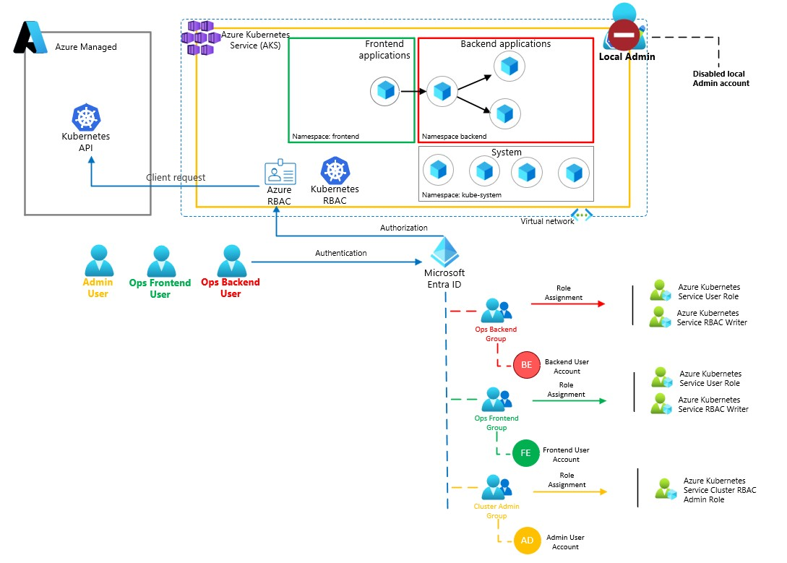

The current architecture can be described as follows:

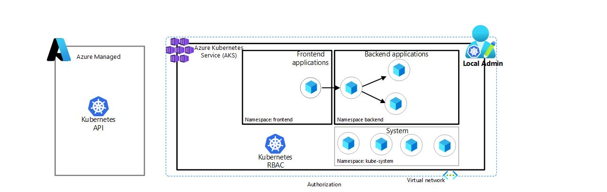

## 1.3 Deployment

### 1.3.1 Prepare Environment Variables
This code defines the environment variables for the resources that you will create later in the tutorial.

> [!Note]
> Ensure environment variable **$STUDENT_NAME** is set before adding the code below.

````bash
ADMIN_GROUP='ClusterAdminGroup-'${STUDENT_NAME}
OPS_FE_GROUP='Ops_Fronted_team-'${STUDENT_NAME}
OPS_BE_GROUP='Ops_Backend_team-'${STUDENT_NAME}

AAD_OPS_FE_UPN='opsfe-'${STUDENT_NAME}'@MngEnvMCAP148390.onmicrosoft.com'
AAD_OPS_FE_DISPLAY_NAME='Frontend-'${STUDENT_NAME}
AAD_OPS_FE_PW=<ENTER USER PASSWORD>

AAD_OPS_BE_UPN='opsbe-'${STUDENT_NAME}'@MngEnvMCAP148390.onmicrosoft.com'
AAD_OPS_BE_DISPLAY_NAME='Backend-'${STUDENT_NAME}
AAD_OPS_BE_PW=<ENTER USER PASSWORD>


AAD_ADMIN_UPN='clusteradmin'${STUDENT_NAME}'@MngEnvMCAP148390.onmicrosoft.com'
AAD_ADMIN_PW=<ENTER USER PASSWORD>
AAD_ADMIN_DISPLAY_NAME='Admin-'${STUDENT_NAME}
````
### 1.3.2 Create Microsoft Entra ID Security Groups 

We will now start by creating 3 security groups for respective team.

1) Create the security group for **Cluster Admins**

````bash
az ad group create --display-name $ADMIN_GROUP --mail-nickname $ADMIN_GROUP
````
2) Create the security group for **Application Operations Frontend Team**
````bash
az ad group create --display-name $OPS_FE_GROUP --mail-nickname $OPS_FE_GROUP
````
3) Create the security group for **Application Operations Backend Team**
````bash
az ad group create --display-name $OPS_BE_GROUP --mail-nickname $OPS_BE_GROUP
````

Current architecture can now be described as follows:

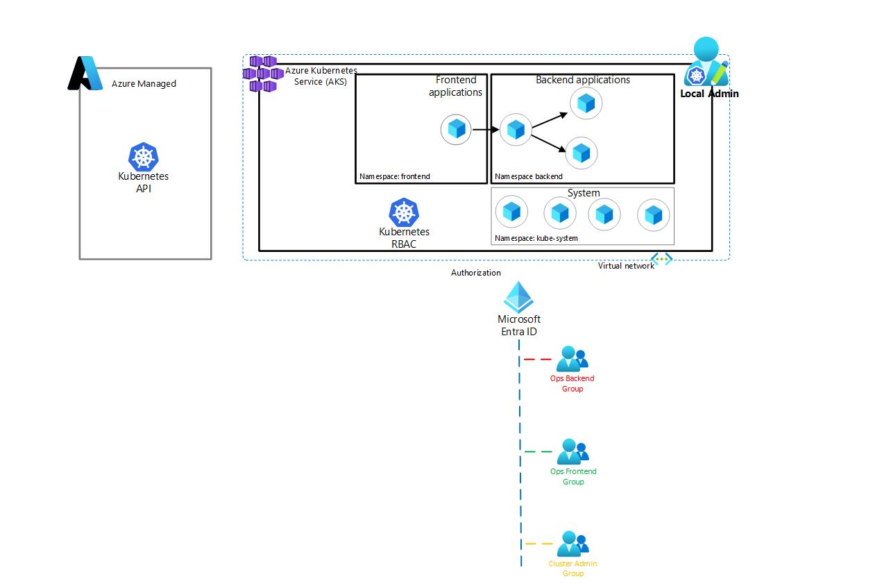


### 1.3.3 Integrate AKS with Microsoft Entra ID

1) Lets update our existing AKS cluster to support Microsoft Entra ID integration, and configure a cluster admin group, and disable local admin accounts in AKS, as this will prevent anyone from using the **--admin** switch to get full cluster credentials.

````bash
az aks update -g $SPOKE_RG -n $AKS_CLUSTER_NAME-${STUDENT_NAME}  --enable-azure-rbac --enable-aad --disable-local-accounts
````

Current architecture can now be described as follows:

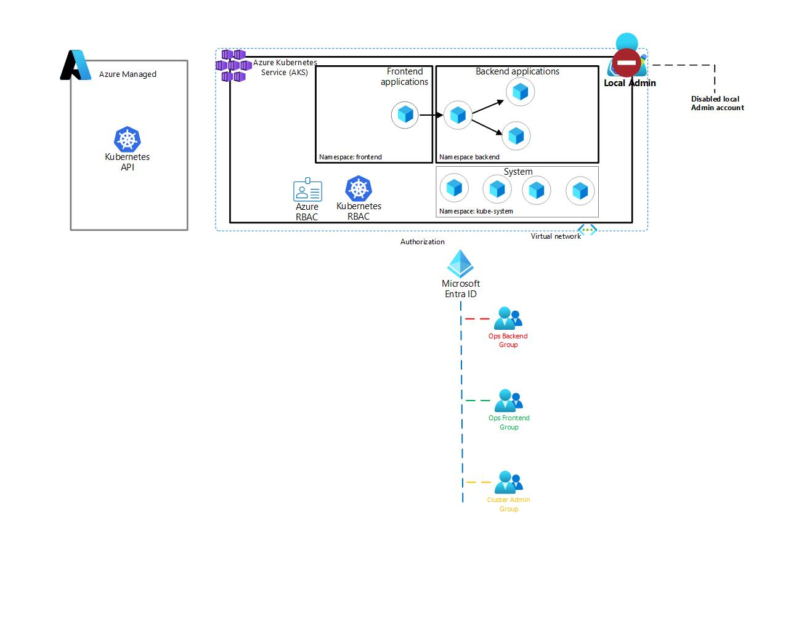

### 1.3.4 Scope and Role Assignment for Security Groups
This chapter will explain how to create the scope for the operation teams to perform their daily tasks. The scope is based on the AKS resource ID and a fixed path in AKS, which is **/namespaces/<NAMESPACE>**. The scope will assign the **Application Operations Frontend Team** to the **frontend namespace** and the **Application Operation Backend Team** to the **backend namespace**.


 1) Lets start by constructing the scope for the operations team.
 ````bash
 AKS_BACKEND_NAMESPACE='/namespaces/backend'
 AKS_FRONTEND_NAMESPACE='/namespaces/frontend'
 AKS_RESOURCE_ID=$(az aks show -g $SPOKE_RG -n $AKS_CLUSTER_NAME-${STUDENT_NAME} --query 'id' --output tsv)
 ````
2) lets fetch the Object ID of the operations teams and admin security groups.

  Application Operation Frontend Team.
 ````bash
 FE_GROUP_OBJECT_ID=$(az ad group show --group $OPS_FE_GROUP --query 'id' --output tsv)
 ````
 Application Operation Backend Team.
  ````bash
 BE_GROUP_OBJECT_ID=$(az ad group show --group $OPS_BE_GROUP --query 'id' --output tsv)
 ````
 Admin.
 ````bash
 ADMIN_GROUP_OBJECT_ID=$(az ad group show --group $ADMIN_GROUP --query 'id' --output tsv)
 
````

 3) This commands will grant the **Application Operations Frontend Team** group users the permissions to download the credential for AKS, and only operate within given namespace.

````bash
az role assignment create --assignee $FE_GROUP_OBJECT_ID --role "Azure Kubernetes Service RBAC Writer" --scope ${AKS_RESOURCE_ID}${AKS_FRONTEND_NAMESPACE}
 ````

 ````bash
 az role assignment create --assignee $FE_GROUP_OBJECT_ID --role "Azure Kubernetes Service Cluster User Role" --scope ${AKS_RESOURCE_ID}
 ````
 4) This commands will grant the **Application Operations Backend Team** group users the permissions to download the credential for AKS, and only operate within given namespace.

````bash
az role assignment create --assignee $BE_GROUP_OBJECT_ID --role "Azure Kubernetes Service RBAC Writer" --scope ${AKS_RESOURCE_ID}${AKS_BACKEND_NAMESPACE}
 ````
  ````bash
 az role assignment create --assignee $BE_GROUP_OBJECT_ID --role "Azure Kubernetes Service Cluster User Role" --scope ${AKS_RESOURCE_ID}
 ````

 4) This command will grant the **Admin** group users the permissions to connect to and manage all aspects of the AKS cluster.

````bash
az role assignment create --assignee $ADMIN_GROUP_OBJECT_ID --role "Azure Kubernetes Service RBAC Cluster Admin" --scope ${AKS_RESOURCE_ID}
 ````

Current architecture can now be described as follows:

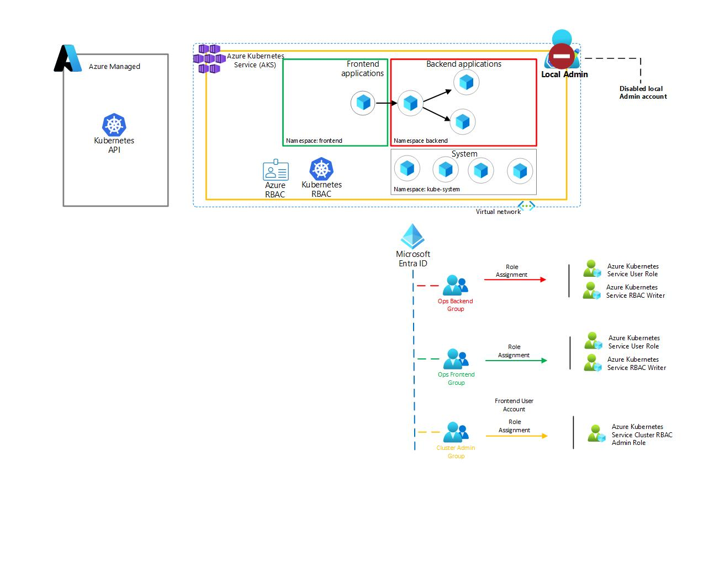

### 1.3.5 Create Users and Assign them to Security Groups.
This exercise will guide you through the steps of creating three users and adding them to their corresponding security groups.

1) Create the Admin user.

````bash
az ad user create --display-name $AAD_ADMIN_DISPLAY_NAME  --user-principal-name $AAD_ADMIN_UPN --password $AAD_ADMIN_PW
````
2) Assign the admin user to admin group for the AKS cluster.

First identify the object id of the user as we will need this number to assign the user to the admin group.

````bash
ADMIN_USER_OBJECT_ID=$(az ad user show --id $AAD_ADMIN_UPN --query 'id' --output tsv)
````
Assign the user to the admin security group.

````bash
az ad group member add --group $ADMIN_GROUP --member-id $ADMIN_USER_OBJECT_ID
````
3) Create the frontend operations user.

````bash
az ad user create --display-name $AAD_OPS_FE_DISPLAY_NAME  --user-principal-name $AAD_OPS_FE_UPN --password $AAD_OPS_FE_PW
````
4) Assign the frontend operations user to frontend security group for the AKS cluster.

First identify the object id of the user as we will need this number to assign the user to the frontend security group.

````bash
FE_USER_OBJECT_ID=$(az ad user show --id $AAD_OPS_FE_UPN --query 'id' --output tsv)
````
Assign the user to the frontend security group.

````bash
az ad group member add --group $OPS_FE_GROUP --member-id $FE_USER_OBJECT_ID
````
5) Create the backend operations user.

````bash
az ad user create --display-name $AAD_OPS_BE_DISPLAY_NAME  --user-principal-name $AAD_OPS_BE_UPN --password $AAD_OPS_BE_PW
````
6) Assign the backend operations user to backend security group for the AKS cluster.

First identify the object id of the user as we will need this number to assign the user to the backend security group.

````bash
BE_USER_OBJECT_ID=$(az ad user show --id $AAD_OPS_BE_UPN --query 'id' --output tsv)
````
Assign the user to the backend security group.

````bash
az ad group member add --group $OPS_BE_GROUP --member-id $BE_USER_OBJECT_ID

````
Current architecture can now be described as follows:

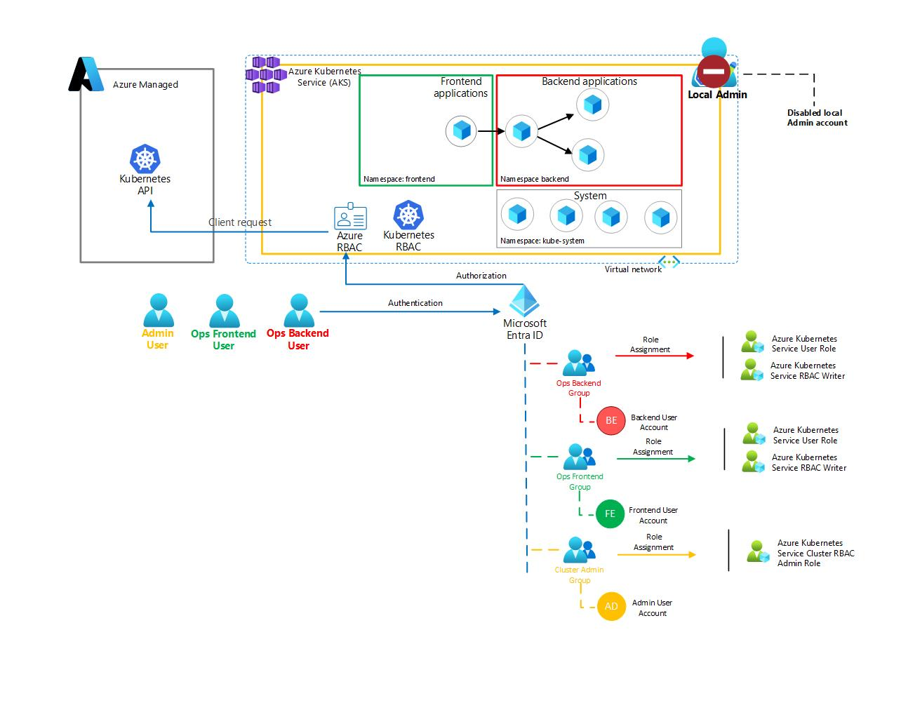

Validate your deployment in the Azure portal.

7) Navigate to the Azure portal at [https://portal.azure.com](https://portal.azure.com) and enter your login credentials.

8) Once logged in, on your top left hand side, click on the **portal menu** (three strips).

9) From the menu list click on **Microsoft Entra ID**.

10) On your left hand side menu under **Manage** click on **Users**.
    
11) Validate that your users are created, there shall be **three users**, each user name shall end with your student name.

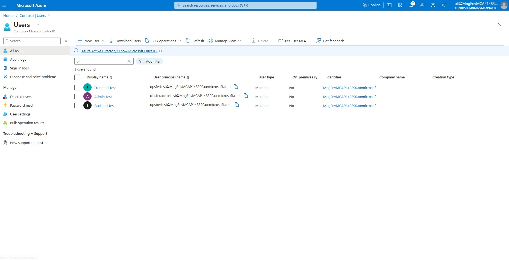

> [!Note]
> In the workshop tenant their may be more users configured, ensure you identify your three users which ends with your student name.

12) On the top menu bar click on **Contoso | Users** link.


13) On your left hand side menu under **Manage** click on **Groups**. Ensure you have three groups as depicted in the picture, the group names should end with your student name.

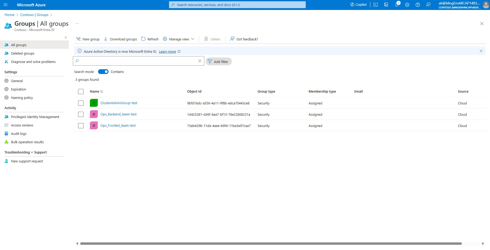

14) Click on security group called **Ops_Backend_team-YOUR STUDENT NAME**.
    
15) On your left hand side menu click on **Members**, verify that your user Backend-YOUR STUDENT NAME is assigned. 

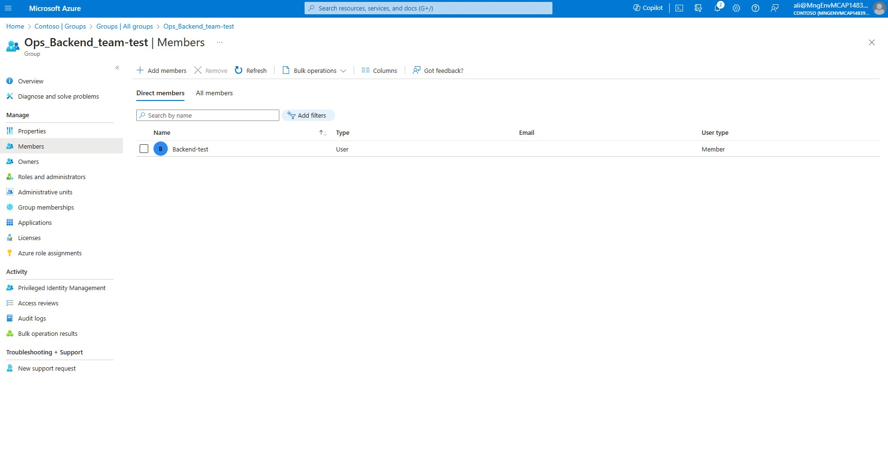

16) On your left hand side menu click on **Azure role Assignments**, from the drop down menu select your subscription. Ensure the following roles are assigned to the group: **Azure Kubernetes service Cluster User Role** assigned on the Cluster level and **Azure Kubernetes Service RBAC Writer** assigned on the namespace level called **backend**.

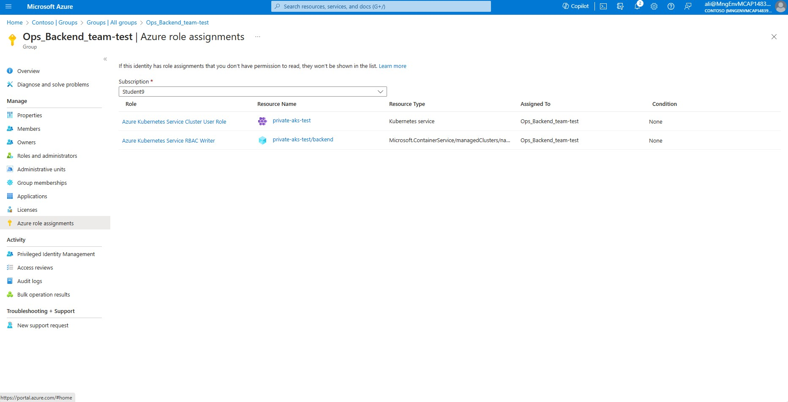

17) On the top menu bar click on **Contoso | Groups** link. Repeat step 13 - 16 for **Ops_Frontend_team-YOUR STUDENT NAME** and **ClusterAdminGroup-YOUR STUDENT NAME**

### 1.3.6 Validate the Access for the Different Users.

This section will demonstrate how to connect to the AKS cluster from the jumpbox using the user account defined in Microsoft Entra ID. We will check two things: first, that we can successfully connect to the cluster; and second, that the Operations teams have access only to their own namespaces, while the Admin has full access to the cluster.

1) Navigate to the Azure portal at [https://portal.azure.com](https://portal.azure.com) and enter your login credentials.

2) Once logged in, locate and select your **rg-hub** where the Jumpbox has been deployed.

3) Within your resource group, find and click on the **Jumpbox VM**.

4) In the left-hand side menu, under the **Operations** section, select ‘Bastion’.

5) Enter the **credentials** for the Jumpbox VM and verify that you can log in successfully.

First remove the existing stored configuration that you have previously downloaded with Azure CLI and kubectl.

6) From the **Jumpbox VM** execute the following commands:

````bash
rm -R .azure/
rm -R .kube/
````

> [!Note]
> The .azure and .kube directories store configuration files for Azure and Kubernetes, respectively, for your user account. Removing these files triggers a login prompt, allowing you to re-authenticate with different credentials.


7) Retrieve the username and password for Frontend user.

> [!IMPORTANT]
> Retrieve the username and password from your local shell, and not the shell from Jumpbox VM.

````bash
echo $AAD_OPS_FE_UPN
echo $AAD_OPS_FE_PW
````

8) From the **Jumpbox VM ** initiate the authentication process.


````bash
az login
````
Example output:

````bash
azureuser@Jumpbox-VM:~$ az login
To sign in, use a web browser to open the page https://microsoft.com/devicelogin and enter the code FPT7AXRKE to authenticate.
````
9) Open a new tab in your web browser and access https://microsoft.com/devicelogin. Enter the generated **code**, and press ***Next**

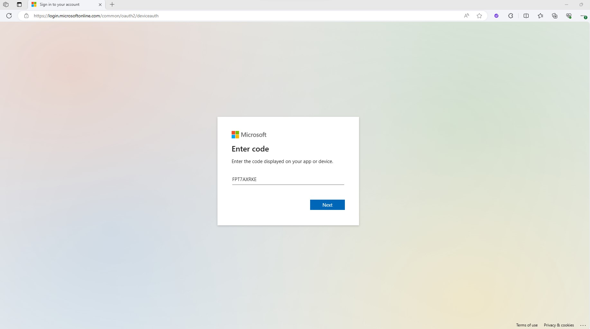


10) You will be prompted with an authentication window asking which user you want to login with select **Use another account** and supply the username in the **AAD_OPS_FE_UPN** variable and password from variable **AAD_OPS_FE_PW** And then press **Next**.

> [!Note]
> When you authenticate with a user for the first time, you will be prompted by Microsoft Authenticator to set up Multi-Factor Authentication (MFA). Choose **"I want to setup a different method"** option from the drop-down menu, and select **Phone**, supply your phone number, and receive a one-time passcode to authenticate to Azure with your user account.

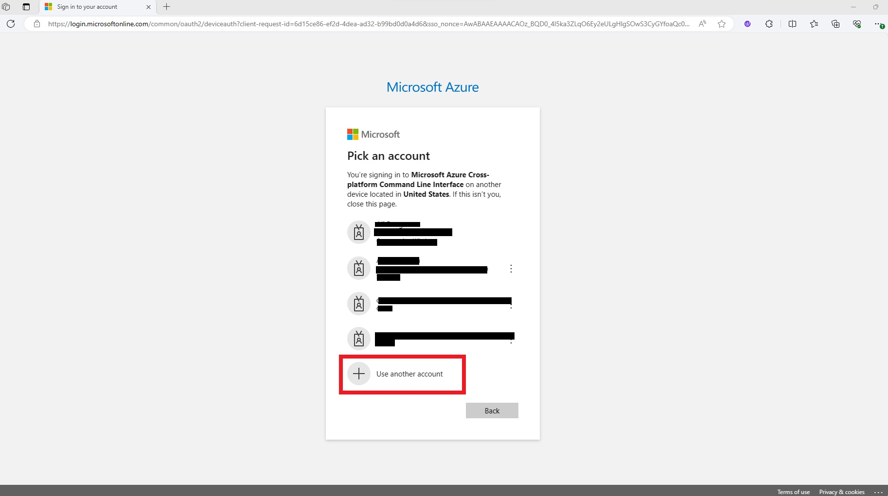

  

11) From the **Jumpbox VM** download AKS cluster credential.

````bash
SPOKE_RG=rg-spoke
STUDENT_NAME=<YOUR STUDENT NAME>
AKS_CLUSTER_NAME=private-aks
az aks get-credentials --resource-group $SPOKE_RG --name $AKS_CLUSTER_NAME-${STUDENT_NAME}
````
You should see a similar output as illustrated below:

````bash
azureuser@Jumpbox-VM:~$ az aks get-credentials --resource-group $SPOKE_RG --name $AKS_CLUSTER_NAME-${STUDENT_NAME}
Merged "private-aks" as current context in /home/azureuser/.kube/config
azureuser@Jumpbox-VM:~$ 
````
12) You should be able to list all pods in namespace frontend.

> [!IMPORTANT]
> You will now be prompted to authenticate your user again, as this time it will validate your newly created user permissions within the AKS cluster. Ensure you login with the user you created i.e $AAD_OPS_FE_UPN, $AAD_OPS_BE_UPN or $AAD_ADMIN_UPN and **not your company email address**.

````bash
kubectl get po -n frontend
````
````bash
azureuser@Jumpbox-VM:~$ kubectl get po -n frontend
To sign in, use a web browser to open the page https://microsoft.com/devicelogin and enter the code 
XXXXXXX to authenticate.
NAME    READY   STATUS             RESTARTS   AGE
nginx   1/1     Running               0       89m
````
13) Try to list pods in default namespace

````bash
kubectl get pods
````
Example output:
````bash
azureuser@Jumpbox-VM:~$ kubectl get po
Error from server (Forbidden): pods is forbidden: User "opsfe-test@MngEnvMCAP148390.onmicrosoft.com"
 cannot list resource "pods" in API group "" in the namespace "default": User does not have access t
o the resource in Azure. Update role assignment to allow access.
````
Repeat step **6** and **13** for the remaining users, and see how their permissions differs.
````bash
# Username and password for Admin user execute the command from your local shell and not from Jumpbox VM
echo $AAD_ADMIN_UPN
echo $AAD_ADMIN_PW

# Username and password for Backend user execute the command from your local shell and not from Jumpbox VM
echo $AAD_OPS_BE_UPN
echo $AAD_OPS_BE_PW

````
14) Ensure you clean up your local Azure and kubernetes configuration.

Assign your Student user account to AKS admin cluster group in Microsoft Entra ID. Execute the following command from you local shell, and **not the shell in the Jumbox VM**. 

````bash
AAD_STUDENT_UPN=$(az account show --query 'user.name' --output tsv)
STUDENT_USER_OBJECT_ID=$(az ad user show --id $AAD_STUDENT_UPN --query 'id' --output tsv)
az ad group member add --group $ADMIN_GROUP --member-id $STUDENT_USER_OBJECT_ID
````
From the **Jumpbox VM**, execute the following command.

````bash
# Remove the configuration
rm -R .azure/
rm -R .kube/
````
From the **Jumpbox VM**, execute the following command and login with your Student account.

````bash
# Authenticate to Azure
az login
````
````bash
# Re-authenticate to AKS with your Student account.
az aks get-credentials --resource-group $SPOKE_RG --name $AKS_CLUSTER_NAME-${STUDENT_NAME}
````