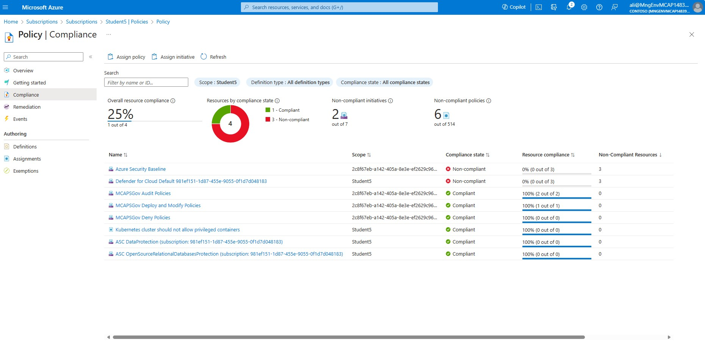

# Governance

**In This Article:**

- [Governance](#governance)
  - [1.1 Introduction](#11-introduction)
  - [1.2 Deployment](#12-deployment)
    - [1.2.1 Assign Azure Policy to Subcription.](#121-assign-azure-policy-to-subcription)
    - [1.2.2 Enable Azure Policy add-on for Azure Kubernetes Services.](#122-enable-azure-policy-add-on-for-azure-kubernetes-services)
    - [1.2.3 Validate Deployment in Azure Portal](#123-validate-deployment-in-azure-portal)
    - [1.2.4 Deploy a Privileged Pod to Azure Kubernetes Services](#124-deploy-a-privileged-pod-to-azure-kubernetes-services)


You can apply and enforce built-in security policies on your Azure Kubernetes Service (AKS) clusters using
Azure Policy. Azure Policy helps enforce organizational standards and assess compliance at-scale. After you install the
Azure Policy add-on for AKS, you can apply individual policy definitions or groups of policy definitions called initiatives (sometimes called policysets) to your cluster. See Azure Policy built-in definitions for AKS
for a complete list of AKS policy and initiative definitions.

This article emphasizes the implementation of robust security practices within your Azure Kubernetes Services (AKS) Cluster. By enforcing specific policies, we can enhance the overall security posture by means of using Azure Policy. Let’s delve into the details:

1. **Preventing Privileged Containers:**
   - Primary focus in this article is to prevent the execution of privileged containers within the AKS Cluster.
  
    - Privileged containers have elevated permissions, which can lead to unrestricted access to the underlying host operating system.
  
    - Examples of restrictions imposed by policy:
      - Hardware Device Access: Privileged containers won’t be able to access hardware devices.
  
      - Process Visibility: They won’t have visibility into processes running in other containers.
  
      - Network Manipulation: Privileged containers cannot manipulate network stacks.


## 1.1 Introduction

In this section, you will get a walk through of the steps to secure your Azure Kubernetes Service (AKS) clusters using Azure Policy:

- **Enable Azure Policy Add-on for AKS**:

- **Enforce Azure Built-in Policies**:

- **Deploy a Privileged Pod Blocked by Policy**:

- **Validate Compliance State**:

Remember, Azure Policy helps maintain consistency and security across your AKS clusters, ensuring adherence to best practices and compliance requirements. 

## 1.2 Deployment

### 1.2.1 Assign Azure Policy to Subcription.

In this section, we will apply an Azure built-in policy definition named **“Kubernetes cluster should not allow privileged containers.”** on subscription level. This definition includes the required configuration to prevent privileged containers from being created within our cluster.

1) In order to apply an Azure built in Policy on subscription level, we first need to obtain our subscription id. From you **local shell** get the subscription ID.

````bash
SUBSCRIPTION=$(az account show --query id -o tsv)
````
> [!IMPORTANT]
> Before proceeding with Step 1, make sure you are logged in to the correct subscription. You can verify this by running the following command: ````az account show````:

2) Let’s retrieve the **policy definition ID** for the **“Kubernetes cluster should not allow privileged containers”** policy. We’ll use this ID later when applying the policy at the subscription level.

````bash
POLICY_DEFINITION_ID=$(az policy definition list --query "[?displayName=='Kubernetes cluster should not allow privileged containers'].{NAME:name}" --output tsv)
````

3) Assign the policy to the subscription and name the policy for **"Kubernetes cluster should not allow priviliged containers"**.
````bash
az policy assignment create --name "Kubernetes cluster should not allow privileged containers" --policy $POLICY_DEFINITION_ID --scope /subscriptions/$SUBSCRIPTION
````

> [!Note]
> For simplicity, we have chosen to name the Policy the same as the definition name. However, you have the flexibility to assign a different name if desired. The policy has been assigned to the subscription, and it may take up to **20 minutes** before the policy enforcement takes effect.

### 1.2.2 Enable Azure Policy add-on for Azure Kubernetes Services.

1) Enable the Azure Policy add-on for you AKS cluster.

````bash
az aks enable-addons --addons azure-policy --resource-group $SPOKE_RG --name $AKS_CLUSTER_NAME-${STUDENT_NAME}
````
2) Verify that the add-on installation was succesful and that azure-policy and gatekeeper are running, by executing the following command from the **Jumpbox VM**.

````bash
# Verify that gatekeeper-system namespace is created.
kubectl get namespace
````
Example output:

````bash
azureuser@Jumpbox-VM:~$ kubectl get namespace
NAME                STATUS   AGE
backend             Active   36h
default             Active   2d10h
frontend            Active   36h
gatekeeper-system   Active   54m
kube-node-lease     Active   2d10h
kube-public         Active   2d10h
kube-system         Active   2d10h
````
````bash
# azure-policy pod is installed in kube-system namespace
kubectl get pods -n kube-system
````
````bash
# gatekeeper pod is installed in gatekeeper-system namespace
kubectl get pods -n gatekeeper-system
````
> [!Note]
> Gatekeeper extends the capabilities of Azure Policy by integrating with Open Policy Agent (OPA). It acts as an admission controller webhook for your AKS clusters. For more information refer to [Understand Azure Policy for Kubernetes clusters](https://learn.microsoft.com/en-us/azure/governance/policy/concepts/policy-for-kubernetes)


### 1.2.3 Validate Deployment in Azure Portal

In this section we will acccess the Azure portal to validate our policy compliance state, we will also explore the Azure built in policies.

1) Navigate to the Azure portal at [https://portal.azure.com](https://portal.azure.com) and enter your login credentials.

2) Once logged in, in the search field type in **Subscriptions**.
3) From the drop down menu choose **Subscriptions**.
4) Select your **Subscription**
5) On your left hand side menu under **Settings** select **Policies**
6) Verify that you have a policy called **"Kubernetes Cluster should not allow privileged containers".**



> [!Note]
> Your policy may be in a **Not-started** state, it can take up to **20 mins** before the policy change state.

7)  On your left hand side menu select **Definitions**. Here, you’ll find a list of both built-in and custom policies
8) To focus on AKS policies, adjust the **Category filter** to **Kubernetes**  
9) Take a closer look at the definitions available out of the box.

> [!Note]
> By reviewing these policies, you can enhance the security and compliance of your AKS environment.

### 1.2.4 Deploy a Privileged Pod to Azure Kubernetes Services

"We have implemented the following configurations:
- **Subscription-level policy enforcement** for Azure Kubernetes Service (AKS).
- **Enabled the Azure Policy add-on** for AKS.

Now, let's proceed to create a **privileged pod** within AKS. The anticipated outcome is that the pod will be **automatically denied during creation**."


1) From the **JumpBox VM** deploy the following manifest. This Yaml defines, a single container running the nginx image, ````securityContext```` field is set to ````privileged: true````, which means the container will be run in privileged mode. 

````bash
cat <<EOF | kubectl apply -f -
apiVersion: v1
kind: Pod
metadata:
  name: nginx-privileged
spec:
  containers:
  - name: nginx-privileged
    image: $ACR_NAME.azurecr.io/nginx
    securityContext:
      privileged: true
EOF
````
> [!Note]
> Ensure environment variable ````$ACR_NAME```` is loaded in your **JumpBox VM**. You can simply paste it into the terminal directly.

expected output:
````bash
azureuser@Jumpbox-VM:~$ cat <<EOF | kubectl apply -f -
apiVersion: v1
kind: Pod
metadata:
  name: nginx-privileged
spec:
  containers:
  - name: nginx-privileged
    image: $ACR_NAME.azurecr.io/nginx
    securityContext:
      privileged: true
EOF
Error from server (Forbidden): error when creating "STDIN": admission webhook "validation.gatekeeper.sh" denied the request: [azurepolicy-k8sazurev2noprivilege-e12c4338d05b4acd7981] Privileged container is not allowed: nginx-privileged2, securityContext: {"privileged": true}
````