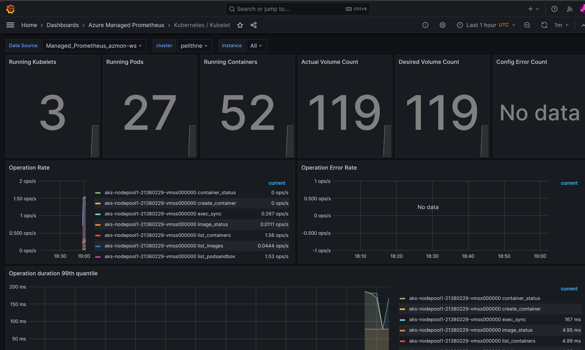
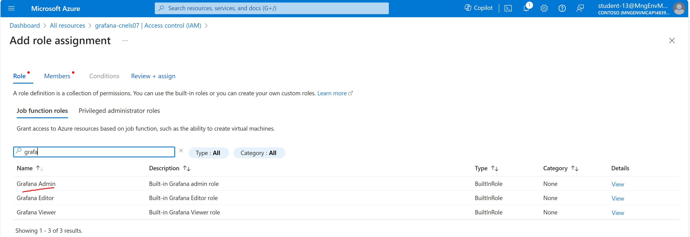

# Monitoring

**In This Article:**

- [Monitoring](#monitoring)
- [1.1 Precondition](#11-precondition)
- [1.2 Enable monitoring for Kubernetes clusters](#12-enable-monitoring-for-kubernetes-clusters)
  - [1.2.1 Enable Prometheus and Grafana](#121-enable-prometheus-and-grafana)
  - [1.2.2 Verify deployment](#122-verify-deployment)
    - [1.2.2.1 Managed Prometheus](#1221-managed-prometheus)
  - [1.3 Create grafana dashboard](#13-create-grafana-dashboard)
  - [1.4 Experimentation time](#14-experimentation-time)
  - [1.5 Enable Container insights](#15-enable-container-insights)
  - [1.6 Verify deployment](#16-verify-deployment)
    - [1.6.1 Container insights](#161-container-insights)
  - [1.7 Enable diagnostic settings to collect logs from your AKS deployment](#17-enable-diagnostic-settings-to-collect-logs-from-your-aks-deployment)
  - [1.8 Create an alert](#18-create-an-alert)
  - [1.9 Optional: Configure data collection in Container insights using ConfigMap](#19-optional-configure-data-collection-in-container-insights-using-configmap)
    - [1.9.1 TODO](#191-todo)
  - [1.10 Experimentation time](#110-experimentation-time)


First, recreate a few environment variables

````bash
HUB_RG=rg-hub
SPOKE_RG=rg-spoke
LOCATION=eastus 
BASTION_NSG_NAME=Bastion_NSG
JUMPBOX_NSG_NAME=Jumpbox_NSG
FW_NAME=azure-firewall
AKS_IDENTITY_NAME=aks-msi
JUMPBOX_VM_NAME=Jumpbox-VM
AKS_CLUSTER_NAME=private-aks
AZ_MON_WORKSPACE=azmon-ws
STUDENT_NAME=<WRITE YOUR STUDENT NAME HERE>
MANAGED_GRAFANA_NAME=grafana-$STUDENT_NAME
LOG_ANALYTICS_WORKSPACE=log-analytics-ws

````

# 1.1 Prerequisite

Open up FW to allow access from the monitoring agents in the Kubernetes cluster to Azure Monitor endpoints. An alternative way to achieve the same goal would be to make the log collection endpoints private within the VNET.

````bash
az network firewall application-rule create --collection-name 'aksfwmon' --firewall-name $FW_NAME -n 'Allow_Azmon' --source-addresses '*' --protocols 'http=80' 'https=443' --target-fqdns "*.handler.control.monitor.azure.com" "*.ingest.monitor.azure.com" "*.monitoring.azure.com" "*.monitor.azure.com" "login.microsoftonline.com" --action Allow --priority 102 --resource-group $HUB_RG
````

# 1.2 Enable monitoring for Kubernetes clusters

This section describes how to enable monitoring of your Kubernetes clusters using the following Azure Monitor features:

- *Managed Prometheus* for metric collection
- *Container insights* for log collection
- *Managed Grafana* for visualization.

You can enable monitoring in multiple different ways. You can use the Azure Portal, Azure CLI, Azure Resource Manager template, Terraform, or Azure Policy. In this section, we will use Azure CLI, but feel free to learn more. A good place to start is here: https://learn.microsoft.com/en-us/azure/azure-monitor/containers/kubernetes-monitoring-enable 


## 1.2.1 Enable Prometheus and Grafana

The only requirement to enable Azure Monitor managed service for Prometheus is to create an Azure Monitor workspace, which is where Prometheus metrics are stored. Once this workspace is created, you can onboard services that collect Prometheus metrics.

```azurecli
az monitor account create --name  $AZ_MON_WORKSPACE --resource-group $SPOKE_RG --location $LOCATION
```

Make a note of the resource id. It should look similar to this ````"/subscriptions/0b6cb75e-8bb1-426b-8c7e-acd7c7599495/resourcegroups/pelithne/providers/microsoft.monitor/accounts/azmon-ws"````

To enable Grafana, you also need to create a Grafana workspace. If you are prompted to install the "amg" extension, just accept that. 

```azurecli
az grafana create --name $MANAGED_GRAFANA_NAME --resource-group $SPOKE_RG
```

Make a note of the resource id. It should look similar to this ````"/subscriptions/0b6cb75e-8bb1-426b-8c7e-acd7c7599495/resourceGroups/pelithne/providers/Microsoft.Dashboard/grafana/managed-grafana-ws"````

Now you can connect the Azure monitor workspace with the Grafana workspace. This will enable you to create Grafana dashboards using data from the Azure monitor workspace, with prometheus metrics enabled.

Use the following example command, but replace with your own information (for example the resource ids created in the previous steps):

```azurecli
 az aks update --enable-azure-monitor-metrics -n $AKS_CLUSTER_NAME-${STUDENT_NAME} -g $SPOKE_RG --azure-monitor-workspace-resource-id "/subscriptions/0b6cb75e-8bb1-426b-8c7e-acd7c7599495/resourcegroups/pelithne/providers/microsoft.monitor/accounts/azmon-ws"  --grafana-resource-id  "/subscriptions/0b6cb75e-8bb1-426b-8c7e-acd7c7599495/resourceGroups/pelithne/providers/Microsoft.Dashboard/grafana/managed-grafana-ws"
 ```


## 1.2.2 Verify deployment
Use *kubectl*  to verify that the agent is deployed properly.

### 1.2.2.1 Managed Prometheus

**Verify that the DaemonSet was deployed properly on the Linux node pools**

```bash
kubectl get ds ama-metrics-node --namespace=kube-system
```

The number of pods should be equal to the number of Linux nodes on the cluster. The output should resemble the following example:

```output
User@aksuser:~$ kubectl get ds ama-metrics-node --namespace=kube-system
NAME               DESIRED   CURRENT   READY   UP-TO-DATE   AVAILABLE   NODE SELECTOR   AGE
ama-metrics-node   1         1         1       1            1           <none>          10h
```

**Verify that the two ReplicaSets were deployed for Prometheus**

```bash
kubectl get rs --namespace=kube-system
```

The output should resemble the following example:

```output
User@aksuser:~$kubectl get rs --namespace=kube-system
NAME                            DESIRED   CURRENT   READY   AGE
ama-metrics-5c974985b8          1         1         1       11h
ama-metrics-ksm-5fcf8dffcd      1         1         1       11h
```

## 1.3 Create grafana dashboard
Go to the "Azure Managed Grafana" resource that was created in your spoke RG. In the blade that opens up, you should see a "Endpoint" that looks similar to this: ```` https://managed-grafana-eqbpc5gdbvh2dub7.eus.grafana.azure.com````

Use the menu (three parallell lines) in the top left of the page, and select "Dashboards".

Expand "Azure Managed Prometheus". Here you will find a number of pre-built dashboards that comes out of the box. Select e.g. ````Kubernetes / Kubelet````

You should see something similar to this (but dont forget to scroll further down):




<br>
<br>
<br>
  

> [!Note]
> Only the user that created the Grafana dashboard gets the permission to view it. 
> To resolve this, other users needs to create a role-assignment of type *Grafana Admin*




## 1.4 Experimentation time
Use google/copilot/your own imagination to experiment a little bit with some dashboards.


## 1.5 Enable Container insights

Create a log-analytics workspace

````azurecli
az monitor log-analytics workspace create -g $SPOKE_RG -n $LOG_ANALYTICS_WORKSPACE
````

Make a note of the log-analytics workspace resource ID. It should look similar to ````subscriptions/0b6cb75e-8bb1-426b-8c7e-acd7c7599495/resourceGroups/rg-spoke/providers/Microsoft.OperationalInsights/workspaces/log-analytics-ws/````


Then enable the monitoring add-on for AKS (use the resource ID from above). 

```azurecli
az aks enable-addons -a monitoring -n $AKS_CLUSTER_NAME-${STUDENT_NAME}  -g $SPOKE_RG --workspace-resource-id "subscriptions/0b6cb75e-8bb1-426b-8c7e-acd7c7599495/resourceGroups/rg-spoke/providers/Microsoft.OperationalInsights/workspaces/log-analytics-ws/"
```


## 1.6 Verify deployment

### 1.6.1 Container insights

**Verify that the DaemonSets were deployed properly on the Linux node pools**

```bash
kubectl get ds ama-logs --namespace=kube-system
```

The number of pods should be equal to the number of Linux nodes on the cluster. The output should resemble the following example:

```output
User@aksuser:~$ kubectl get ds ama-logs --namespace=kube-system
NAME       DESIRED   CURRENT   READY     UP-TO-DATE   AVAILABLE   NODE SELECTOR   AGE
ama-logs   2         2         2         2            2           <none>          1d
```


**Verify deployment of the Container insights solution**

```bash
kubectl get deployment ama-logs-rs --namespace=kube-system
```

The output should resemble the following example:

```output
User@aksuser:~$ kubectl get deployment ama-logs-rs --namespace=kube-system
NAME          READY   UP-TO-DATE   AVAILABLE   AGE
ama-logs-rs   1/1     1            1           24d
```


## 1.7 Create diagnostic settings to collect logs from your AKS deployment

Get the resource ID of your AKS cluster (needed below)
````
AKS_RESOURCE_ID=$(az aks show -g $SPOKE_RG -n $AKS_CLUSTER_NAME-${STUDENT_NAME} --query 'id' --output tsv)
````
When you echo the content of the environment variable it should look similar to this:

````bash
azureuser@Jumpbox-VM:~$ echo $AKS_RESOURCE_ID
/subscriptions/0b6cb75e-8bb1-426b-8c7e-acd7c6599495/resourcegroups/rg-spoke/providers/Microsoft.ContainerService/managedClusters/private-aks
````

Now, create a diagnostic setting that collects all metrics from your AKS cluster and forwards them to the log-analytics workpace previously created.

````
az monitor diagnostic-settings create --resource $AKS_RESOURCE_ID --name ds-morelogs-aks --logs "[{category:kube-apiserver,enabled:true
},{category:kube-audit,enabled:true}]" --resource-group $SPOKE_RG --workspace $LOG_ANALYTICS_WORKSPACE
  ````

Now make a simple Kusto query, by navigating to your AKS cluster in the Azure Portal and clicking on logs in the left hand navigation panel.

Close out the box that appears with suggested queries (this can be useful, but for now will will create our own queries). 

In the "query window" that opens up type in the text below and then press the play button:

````
KubePodInventory 
````
Now you can make the query a little bit more specific:

````
KubePodInventory 
| where PodRestartCount > 5
````

You can also generate more specific info, like this query which display metrics scraped by Azure Monitor and filtered by namespace "prometheus"

````
InsightsMetrics 
| where Namespace contains "prometheus"
| extend tags=parse_json(Tags)
| summarize count() by Name
````

If you want to display results as a bar chart, you can do something like the below. This specific query identifies the ingestion volume of each metrics size in GB per day to understand if it's high. 

````
InsightsMetrics
| where Namespace contains "prometheus"
| where TimeGenerated > ago(24h)
| summarize VolumeInGB = (sum(_BilledSize) / (1024 * 1024 * 1024)) by Name
| order by VolumeInGB desc
| render barchart
````

Or, you could go big and query for average node cpu utilization per minute:
````
// Avg node CPU usage percentage per minute  
// For your cluster view avg node CPU usage percentage per minute over the last hour. 
// To create an alert for this query, click '+ New alert rule'
//Modify the startDateTime & endDateTime to customize the timerange
let endDateTime = now();
let startDateTime = ago(1h);
let trendBinSize = 1m;
let capacityCounterName = 'cpuCapacityNanoCores';
let usageCounterName = 'cpuUsageNanoCores';
KubeNodeInventory
| where TimeGenerated < endDateTime
| where TimeGenerated >= startDateTime
// cluster filter would go here if multiple clusters are reporting to the same Log Analytics workspace
| distinct ClusterName, Computer, _ResourceId
| join hint.strategy=shuffle (
  Perf
  | where TimeGenerated < endDateTime
  | where TimeGenerated >= startDateTime
  | where ObjectName == 'K8SNode'
  | where CounterName == capacityCounterName
  | summarize LimitValue = max(CounterValue) by Computer, CounterName, bin(TimeGenerated, trendBinSize)
  | project Computer, CapacityStartTime = TimeGenerated, CapacityEndTime = TimeGenerated + trendBinSize, LimitValue
) on Computer
| join kind=inner hint.strategy=shuffle (
  Perf
  | where TimeGenerated < endDateTime + trendBinSize
  | where TimeGenerated >= startDateTime - trendBinSize
  | where ObjectName == 'K8SNode'
  | where CounterName == usageCounterName
  | project Computer, UsageValue = CounterValue, TimeGenerated
) on Computer
| where TimeGenerated >= CapacityStartTime and TimeGenerated < CapacityEndTime
| project ClusterName, Computer, TimeGenerated, UsagePercent = UsageValue * 100.0 / LimitValue, _ResourceId
| summarize AggregatedValue = avg(UsagePercent) by bin(TimeGenerated, trendBinSize), ClusterName, _ResourceId

````

## 1.8 Challenge! 

Use the previously created query to create an alert when node CPU utilization is over a threshold (pick a threshold that will generate alerts). 

Here's some help along the way: https://learn.microsoft.com/en-us/azure/azure-monitor/alerts/tutorial-log-alert 


### 1.9 Experiment

Play around, and create a few queries. Pro-tip: if you right click on a field in the output from a query, you can select to include that field in the query (or you can select to exclude it). This is an easy way to start building useful queries. 

Here are some example queries: https://learn.microsoft.com/en-us/azure/azure-monitor/containers/container-insights-log-query#example-log-search-queries

Read more about KubePodInventory here: https://learn.microsoft.com/en-us/azure/azure-monitor/reference/tables/kubepodinventory


## 1.10 Optional: Configure data collection in Container insights using ConfigMap

### 1.10.1 TODO 
https://learn.microsoft.com/en-us/azure/azure-monitor/containers/container-insights-data-collection-configmap
use monitoring-comfig-map.yaml

A few examples

| log_collection_settings           | Value                   | Description                                                 | Default value |
| --------                          | --------                | ---------                                                   | ------- |
| [stdout] enabled                  | true/false              | Controls whether stdout container log collection is enabled | true |
| [stdout] exclude_namespaces       | Comma-separated array   | Array of namespaces for which stdout logs won't be collected| ["kube-system","gatekeeper-system"] |
| [stderr] enabled                  | true/false              | Controls whether stderr container log collection is enabled | true |
| [stderr] exclude_namespaces       | Comma-separated array   | Array of namespaces for which stderr logs won't be collected| ["kube-system","gatekeeper-system"] |
| [collect_all_kube_events] enabled | true/false              | Controls whether Kube events of all types are collected. By default, the Kube events with type Normal aren't collected| false |


//References: https://learn.microsoft.com/en-us/azure/azure-monitor/containers/monitor-kubernetes
