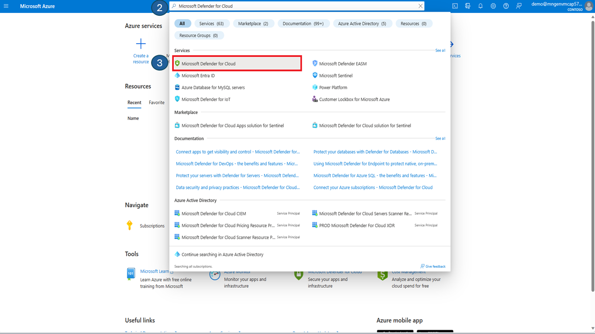
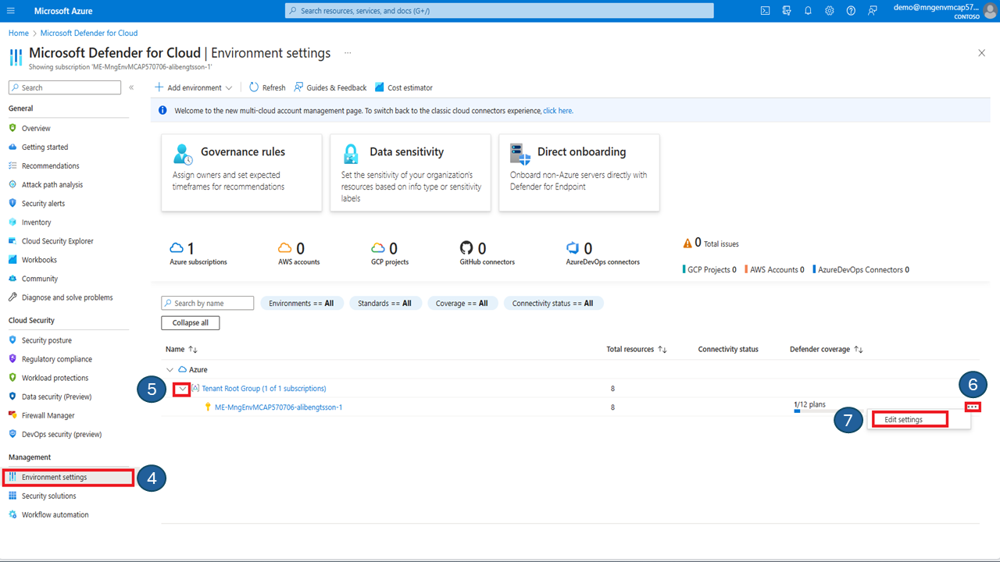

# Defender for Containers

**In This Article:**

- [Defender for Containers](#defender-for-containers)
  - [1.1 Introduction](#11-introduction)
  - [1.2 Prerequisites](#12-prerequisites)
  - [1.3 Generate a Security Alert for Kubernetes Workload](#13-generate-a-security-alert-for-kubernetes-workload)
  - [1.4 Import Vulnerable image to Container Registry](#14-import-vulnerable-image-to-container-registry)
  - [1.5 Review Microsoft Defender for Containers Recommendations](#15-review-microsoft-defender-for-containers-recommendations)


## 1.1 Introduction

Microsoft Defender for Containers is a cloud-native solution that helps you secure your containers and their applications. It protects your Kubernetes clusters from misconfigurations, vulnerabilities, and threats, whether they are running on Azure, AWS, GCP, or on-premises. With Microsoft Defender for Containers, you can:

- Harden your environment by continuously monitoring your cluster configurations and applying best practices.
- Assess your container images for known vulnerabilities and get recommendations to fix them.
- Protect your nodes and clusters from run-time attacks and get alerts for suspicious activities.
- Discover your data plane components and get insights into your Kubernetes and environment configuration.

Microsoft Defender for Containers is part of Microsoft Defender for Cloud, a comprehensive security solution that covers your cloud workloads and hybrid environments. You can enable it easily from the Azure portal and start improving your container security today. Learn more about Microsoft Defender for Containers from [this article](https://learn.microsoft.com/en-us/azure/defender-for-cloud/defender-for-containers-introduction).


During this activity you will:

* Scan container image for vulnerabilities.
* Simulate a security alert for Kubernetes workload.
* Investigate and review vulnerabilities.

Import the metasploit vulnerability emulator docker image from Docker Hub to your Azure container registry.

## 1.2 Prerequisites

Update the firewall to allow AKS to pull images from docker hub.

````bash
az network firewall application-rule create --collection-name 'aksdockerhub' --firewall-name $FW_NAME -n 'Allow_Azmon' --source-addresses '*' --protocols 'http=80' 'https=443' --target-fqdns "*.docker.io" "auth.docker.io" "registry-1.docker.io" "*.monitor.azure.com" "production.cloudflare.docker.com" --action Allow --priority 103 --resource-group $HUB_RG
````

Please make sure that Microsoft Defender for Containers is activated on your subscription. Here are the steps you can follow to enable it.

> [!IMPORTANT]
> Before proceeding with this lab exercise, it is necessary to enable Microsoft Defender for Cloud.


Validate Microsoft Defender for Cloud in the Azure portal.

1) Navigate to the Azure portal at [https://portal.azure.com](https://portal.azure.com) and enter your login credentials.

2) Type in **Microsoft Defender for Cloud** in the search field.
   
3) From the drop down menu click on **Microsoft Defender for Cloud**.


4) Click on **Environment settings** in the left hand side menu under the **Management** section.
   
5) Expand the **Tenant Root Group**
   
6) On the far right hand side of the subscription click on the **three dots** to open the context menu.
   
7) From the context menu click on **Edit settings**.


8) Valiate that **Defender CSPM** is enabled (toggle button set to On) and that monitoring coverage is set to **Full**.
9) Validate that the container plans is enabled (toggle button set to On) and that monitoring coverage is set to **Full**.
10) Login to your jumpbox, lets ensure that the Defender security profile is deployed onto your AKS cluster. run the following command:

````bash
kubectl get po -n kube-system | grep -i microsoft*
````

Example output:
````bash
azureuser@Jumpbox-VM:~$ kubectl get po -n kube-system | grep -i microsoft*
microsoft-defender-collector-ds-5spnc                  2/2     Running   0          79m
microsoft-defender-collector-ds-bqs96                  2/2     Running   0          79m
microsoft-defender-collector-ds-fxh7r                  2/2     Running   0          79m
microsoft-defender-collector-misc-65b968c857-nvnpk     1/1     Running   0          79m
microsoft-defender-publisher-ds-qzzl8                  1/1     Running   0          79m
microsoft-defender-publisher-ds-vk8xl                  1/1     Running   0          79m
microsoft-defender-publisher-ds-x6dxw                  1/1     Running   0          79m
azureuser@Jumpbox-VM:~$ 
````


## 1.3 Generate a Security Alert for Kubernetes Workload


Login to the jumpbox and launch a pod that executes a test command, to simulate a security alert in Microsoft Defender for cloud.

Create a blank file with the following command.

````bash
vim mdctest.yaml
````

In the editor that appears, paste this YAML manifest, which will launch a pod named mdc-test with ubuntu version 18.04 as container image.

````bash
apiVersion: v1
kind: Pod
metadata:
    name: mdc-test
spec:
    containers:
        - name: mdc-test
          image: ubuntu:18.04
          command: ["/bin/sh"]
          args: ["-c", "while true; do echo sleeping; sleep 9600;done"]

````
 *Save and quit*.

Apply the configuration in the file mdctest.yaml. this will create a Pod in the namespace default.

````bash
kubectl apply -f mdctest.yaml
````

Verify that the Pod is in a running state:

````bash
kubectl get pods 
````

Example output:

````bash
NAME       READY   STATUS    RESTARTS   AGE
mdc-test   1/1     Running   0          8s
````
Lets run a bash shell inside the container named **mdc-test**. The bash shell is a common command-line interface that allows you to run various commands and scripts. To do this, we use the following command:

````bash
kubectl exec -it mdc-test -- bash
````
We now whant to copy and run the echo binary, which is a program which prints its arguments to the standard output. this is useful for testing the security alert system in Microsoft Defender for Cloud.

Copy the echo binary to a file named asc_alerttest_662jfi039n in the current working directory.

````bash
cp /bin/echo ./asc_alerttest_662jfi039n
````
Execute the echo binary and print "testing eicar pipe" to the standard out.

````bash
./asc_alerttest_662jfi039n testing eicar pipe
````
Example output:

````bash
mdc@mdc-test: ./asc_alerttest_662jfi039n testing eicar pipe
testing eicar pipe
````
Verify that Microsoft defender has triggered a security alert in Microsoft Defender for Cloud.

1) Go to https://portal.azure.com in your browser and log in if needed.

2) Once you have successfully logged in to Azure, Type in **Microsoft Defender for Cloud** in the search field. 
3) From the drop down menu click on  **Microsoft Defender for Cloud**.


4) On your left hand side menu, under **General** section click on **Security alerts**.

5) You should now see the Security alert, generated by Microsoft Cloud Defender. Click on the **Alert**. 


6) Review the security assessment by clicking on **View full details**.

7) Once you have reviewed the details of the simulated security alert. Put the status of the alert from **Active** to **Resolved**. The security alert will dissapear from the security alert list.


8) Delete the running pod from the AKS cluster

````bash
kubectl delete pods mdc-test
````

## 1.4 Import Vulnerable image to Container Registry

login to your container registry:

````bash
az acr login --name <ACR_NAME>
````

Download the docker image to your **jumpbox VM**:

````bash
docker pull docker.io/vulnerables/metasploit-vulnerability-emulator
````

Tag the docker image:

````bash
docker tag vulnerables/metasploit-vulnerability-emulator $ACR_NAME.azurecr.io/metasploit-vulnerability-emulator
````

Push the vulnerable docker image to azure container registry.

````bash
docker push $ACR_NAME.azurecr.io/metasploit-vulnerability-emulator
````

## 1.5 Review Microsoft Defender for Containers Recommendations

 In this section, you will learn how to review the security recommendations that Defender for Containers generates for your clusters and containers. These recommendations are based on the continuous assessment of your configurations and the comparison with the initiatives applied to your subscriptions. You will also learn how to investigate and remediate the issues that are identified by Defender for Containers.

1) In the Azure portal, Type in **Container registries** in the search field.

2) From the drop down menu click on  **Container Registries**.


3) Click on your **container registry** from the list.


4) On the menu to the left hand side click on **Microsoft Defender for Cloud** to view your **recommendations**.

5) Notice that we have a new recommendation called **Container registry image should have vulnerability findings resolved**


6) To learn how to fix the vulnerability, click on **view additonal recommendations in Defender for cloud**


7) To get more details and mitigation steps for a specific vulnerability, select it from the list. Microsoft Defender for cloud will guide you to harden your container image.


8) Select or search for a **CVE** under the vulnerabilities from the list.

9) **Review** the detailed recommendations from Microsoft Defender for Cloud.


