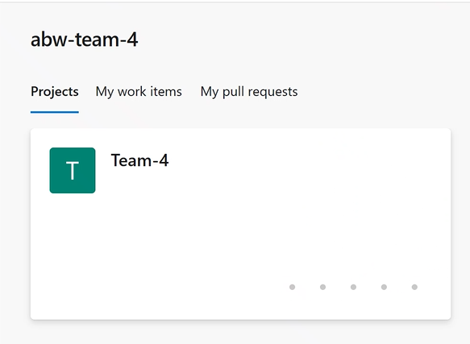
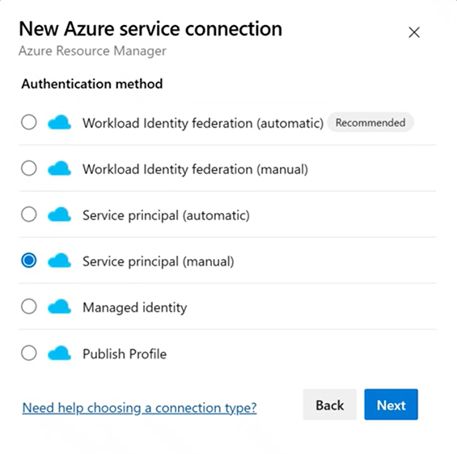
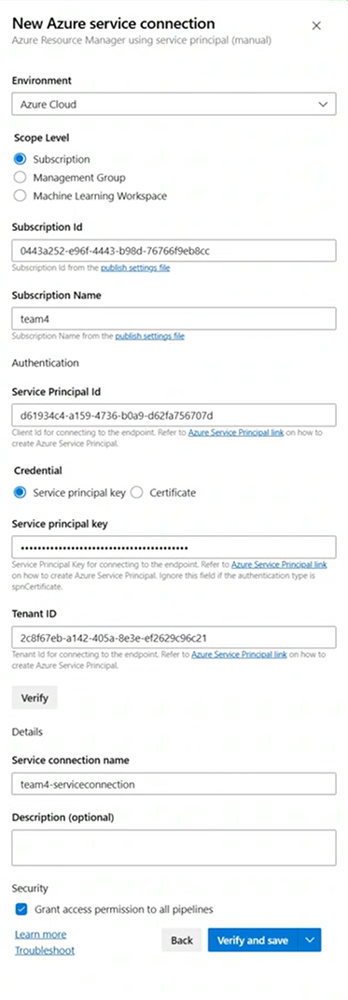

# Automation


## Introduction
This section contains instructions about how to automate deployment of the infrastructure for AKS Secure Baseline, using Azure Devops Pipelines and Terraform. The central idea is to have the complete infrastructure defined as code (IaC) and that deployment of that infrastructure can be completely automated using Deployment Pipelines. 


## Terraform
In this repository, there are a number of Terraform templates. You will not use them directly, and instead call them from a pipeline. It is still a good idea to understand the content of the terraform templates. 

In the folder named "Terraform" you will find the main template, aptly named ````main.tf````

This main template is referencing a number of *modules*. The modules in term are responsible for deploying the various Azure resources used in the AKS Secure Baseline. You will see an AKS module, an application_gateway module, a virtual_network module, and so on.

Please take some time to familiarize yourself with the content of the templates. No need to understand everything, but try to get an overview at least.

## Azure Devops

Azure Devops is the tool that will be used to run the templates. In order to do so, you need to go through a couple of steps, which will be detailed further down:

* Login to the Azure Devops organization (we have prepared the organization for you)
* Create a service connection to Azure, to allow the pipeline to interact with Azure and AKS
* Create a self-hosted agent that will run all the tasks in the pipeline (we have prepared this as well)
* Clone repository (this repository) to give Azure Devops access to the Terraform templates, and the preconfigured pipeline definitions (we have prepared this )
* Edit the necessary parameters, and run the pipeline
* Troubleshoot... :-)

### Login to the Azure Devops organization

Login using the azure identity created for this workshop.


<br>

When logged in you should see something similar to this:





### Create a service connection to Azure

There are different ways to create a connection from Azure Devops to Azure. One of the common approaches (but not the easiest) is to first create a **Service Principle** in Azure, and give that SP the correct permissions in the subscription. And then as a second step, use that Service Principle in Azure Devops. This is the approach we will have today, because this is most likely how you will have to do it in your real tenant.

Create a Service Principle in Azure, and create a Role Assignment that makes the SP **Owner** in the subscription. First make sure you are logged in to the right subscription with your shell (cloudshell is our suggestion for this step).

````bash
SP_NAME=<a meaningful name e.g. your team name>
 
# Login to Azure
az login
 
# Create a service principal
sp=$(az ad sp create-for-rbac --name $SP_NAME --sdk-auth)
 
 
# Get the subscription id of the subscription id.
subscriptionId=$(az account show --query id -o tsv)
 
# Extract the service principal id from the service principal creation output
spId=$(echo $sp | jq -r .clientId)
 
#Fetch the clientSecret from the output
echo $sp | jq -r .clientSecret
 
# Assign the 'Owner' role to the service principal for the subscription
az role assignment create --assignee $spId --role Owner --scope /subscriptions/$subscriptionId
````

Go back to Azure Devops and open up the project called the same thing as your team (we have already created the project for you).

Go to project settings -> service connections 

Choose "Create new service connection" and select **Azure Resource Manager** and press **next**, then select "Service Prinicipal - Manual". 



Fill out the service connection information, using the below image as a template. Use the Service Principal ID and Service Principal Key created in the previous step. 

Give the pipeline a meaningful name and finally check the box named "Grant access permission to all pipelines" and click **Verify and Save**. 




### Create a self-hosted agent
Azure Devops provides "Microsoft hosted agents", but you will instead create a Self hosted agent, that will run on a VM in your subscription in Azure. This is so that the agent is able to access resources in your subscriptions that are isolated inside a VNET (for instance the Kubernetes API). 

In order to provide the Self-hosted agent access to Azure Devops, we need to create a **Personal Access Token**, a PAT. 

In Azure Devops, click on the user settings icon in the top left corner (icon is a person with a "cog") and select "Personal Access Tokens".


In the next window that appears, select "Create New Token". In the dialogue that appears, set "Scopes" to "Full Access" and give the token a descriptive name. Remember to copy the token, as it will not be retrievable.

Now use **Azure Cloudshell** to create the agent, using Terraform. This involves a few steps:

1. Clone the repository (this repository) to get access to the template used to create the agent. Then cd into the directory with the self-hosted template (ado-agent)

````bash
git clone https://github.com/pelithne/AKS_Baseline_Deepdive.git

cd AKS_Baseline_Deepdive/ado-agent/
````

2. Create environment variables needed for Terraform

````bash
export TF_VAR_org_service_url=https://dev.azure.com/<Your devops organization name>
export TF_VAR_personal_access_token=<Previously created PAT>
````
3. Initialize Terraform (important that you are located in AKS_Baseline_Deepdive/ado-agent/)

````bash
terraform init
````

You should see the init completing successfully


4. If ````terraform init```` returned without errors, run ````terraform plan```` to create a deployment (but not yet deploy). You will be asked to create a password to be able to access the VM later. Choose something you will remember!

````bash
terraform plan -out plan.out
````

5. Terraform plan will display all the changes it will deploy, and store that in the output file, ````plan.out````. When it completes withouth errors, you can use the content in ````plan.out```` to deploy the hosted agent, using ````terraform apply````:

````bash
terraform apply plan.out
````

If all went well, this should deploy a VM into a VNET in your subscription and configure the VM with the necessary tools to act as a Self-hosted Agent. In Azure devops it will show up as a self-hosted agent, in the **default** agent pool (more about this later).

This step will also create a storage account that the self hosted agent will use store the terraform state file. 

This is how it should look in Azure Devops, after deployment is complete (it can take up to 10 minutes)


### Clone repository in ADO

Before you can execute the Azure Devops pipeline, you need to "download" all the terraform templates and other things in the repo, to make it available to Azure devops (the repository is in github, remember). 

Go to **repositories** in the left hand navigation bar. Since this project is empty, there will be no repository here. Instead you should import **this** repository.

Select **Import a Repository** and in the blade that opens up, just paste in the address to **this** repo in the **clone URL** field, and press **import**


### Create Pipeline


Now you can select **Pipelines** from the left hand navigation bar. You should see something similar to this:


<br>

Go ahead and **Create Pipeline**

You will now be asked to provide Azure Devops with the location of your code. The code has been imported to your Azure Devops repository, so select **Azure Repos Git**. 


<br>


Then just select the repository, which should be **AKS_Baseline_Deepdive** (this repo). 


<br>

Now, select **Existing Azure Pipelines YAML file** (the alternative at the very bottom)


<br>

Finally, you need to specify which pipeline to use. The correct one is ````/pipelines/cd-validate-plan-apply-one-stage-vars.yml```` in the ````main```` branch.


### Create global variables

The predefined pipeline needs a few variables to run. Go to **Pipelines** -> **Library** in the left hand navigation bar and select **create new variable group**


Then fill out the values as in the image below, using values relevant to your subscription (as described in the table under the image). It is important to name the the group **global-variables** as this is the name we used in the pre-created pipeline.


| Key                              | Description                                                       |
|----------------------------------|-------------------------------------------------------------------|
| ssh-public-key                   | use e.g. ssh-keygen to generate a key pair. Use the public key here |
| TerraformBackendContainerName    | tfstate                                                           |
| TerraformBackendResourceGroupName| rg-agent-terraform                                                |
| TerraformBackendStorageAccountKey| terraform.tfstate                                                 |
| TerraformBackendStorageAccountName| name of the storage account created in a previous step         |

<br>

### Run the pipeline

Take a minute to review the pipeline. It's in yaml-format and is reasonably human-understandable. When you have started understanding, go ahead and replace the following variables with information relevant to your subscription. 


The "azureSubscription" variable should point to the service connection **name** you previously created.
````yaml
- name: azureSubscription
  value: <service connection name>
````


The "prefix" needs to be unique. For instance you can use a corporate signum. 
````yaml
- name: prefix
  value: <use a globally unique prefix here>
````


 
All you have to do now, is to run the pipeline (and probably do some more troubleshooting...)

> [!Note]
> The first time you run the pipeline, you will have to approve a few accesses, before the pipeline is allowed to run.


<br>

After approving, go ahead and RUN!


Now go and pour a nice cup of coffee (or your beverage of choice). Take your time, because this might take a while. And when you come back, if all went according to expectations, you have deployed the AKS Secure Baseline using Infrastructure as Code. 

:sweat_smile:   

