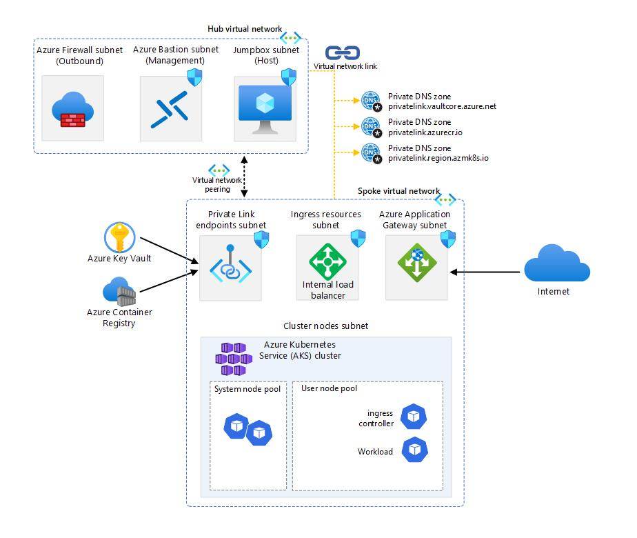

# AKS Secure Baseline Workshop

Welcome to the AKS baseline workshop. In this workshop, you will learn how to deploy a secure and scalable Kubernetes cluster on Azure using Azure Kubernetes Service (AKS).You will also learn how to apply the best practices from the AKS secure baseline reference architecture, which provides a recommended starting point for a general purpose AKS cluster infrastructure. 

The workshop has two main themes. The first one describes how to deploy the AKS secure baseline using Azure CLI. This is essentially an "AKS Secure Baseline - The Hard Way". The second main part is centered around Terraform and how *Infrastructure as Code* can be used to deploy the baseline in a much easier and much more reproducible way.

Apart from these main topics, there are a number of additional sections intended to give a better understanding of how Kubernetes upgrades are managed, how governance can be setup, how to configure observability etc, etc.

**There are 9 hands-on exercises that you will go through during the workshop:**

1: <a href="01-ip-planning.md">IP Planning</a>

2: <a href="02-deploy-infrastructure.md">Deploy Infrastructure</a>

3: <a href="03-workload-protection.md">Workload Protection</a>

4: <a href="04-access-management.md">Access Management</a>

5: <a href="05-upgrade-management.md">Upgrade Management</a>

6: <a href="06-governance.md">Governance</a>

7: <a href="07-monitoring.md">Monitoring</a>

8: <a href="08-defender-for-containers.md">Defender for Containers</a>

9: <a href="09-automation.md">Automation</a>

# Introduction

This workshop is designed for intermediate to advanced Kubernetes users who want to improve their skills and knowledge on AKS. You will need to have some familiarity with Kubernetes concepts and tools, such as pods, services, deployments, kubectl, and Helm. You will also need to have an Azure subscription and access to a terminal or shell environment.

By the end of this workshop, you will have a deeper understanding of how to use AKS to deploy and manage a secure and scalable Kubernetes cluster on Azure. You will also have a working AKS cluster that follows the AKS secure baseline reference architecture.

## Target Architecture

Throughout the workshop, this is the target architecture we will aim to create:
all procedures will be conducted by using Azure CLI.

